# ALPHASPARSEWIKI

## Table of Contents

- [项目简介](about:blank#page-1)
- [快速入门](about:blank#page-2)
- [多平台架构设计](about:blank#page-3)
- [API 设计理念](about:blank#page-4)
- [稀疏矩阵格式](about:blank#page-5)
- [BLAS 等级函数](about:blank#page-6)
- [CPU 后端实现](about:blank#page-7)
- [GPU 后端实现](about:blank#page-8)
- [构建系统](about:blank#page-9)
- [测试框架](about:blank#page-10)
- [如何贡献](about:blank#page-11)

## 项目简介

### Related Pages

Related topics: [多平台架构设计](about:blank#page-3)

- Relevant source files
    
    以下是用于生成此维基页面的上下文文件：
    
    - [hip/kernel/level3/ac/acSpGEMM_MergeMaxChunks.h](hip/kernel/level3/ac/acSpGEMM_MergeMaxChunks.h)
    - [arm/test/CMakeLists.txt](arm/test/CMakeLists.txt)
    - [hip/kernel/level3/ac/MultiplyKernels.h](hip/kernel/level3/ac/MultiplyKernels.h)
    - [cuda/test/CMakeLists.txt](cuda/test/CMakeLists.txt)
    - [include/alphasparse/kernel_plain/kernel_csr_c.h](include/alphasparse/kernel_plain/kernel_csr_c.h)
    - [include/alphasparse/kernel_plain/kernel_csc_c.h](include/alphasparse/kernel_plain/kernel_csc_c.h)
    - [include/alphasparse/kernel_plain/kernel_dia_c.h](include/alphasparse/kernel_plain/kernel_dia_c.h)
    - [hip/kernel/level3/ac/acSpGEMM_MergeGeneralized.h](hip/kernel/level3/ac/acSpGEMM_MergeGeneralized.h)
    - [cuda/kernel/level3/ac/MultiplyKernels.h](cuda/kernel/level3/ac/MultiplyKernels.h)

# 项目简介

AlphaSparse 是一个专注于稀疏矩阵计算的高性能库。它旨在提供一套跨平台的稀疏线性代数子程序，支持多种硬件架构，包括 NVIDIA GPU (CUDA)、AMD GPU (HIP) 以及多种 CPU 平台（如 ARM 和 Hygon）。该库实现了稀疏 BLAS（基础线性代数子程序）规范中的核心功能，涵盖了 Level 2 和 Level 3 的操作，例如稀疏矩阵-向量乘法 (SpMV)、稀疏矩阵-稠密矩阵乘法 (SpMM) 以及稀疏通用矩阵-矩阵乘法 (SpGEMM)。

该项目的核心特点是其模块化和可移植的架构，为不同的硬件后端提供了专门的内核实现，同时通过统一的接口对外提供服务。项目包含针对不同稀疏矩阵存储格式（如 CSR、CSC、DIA）的优化算法，并特别实现了一种先进的 SpGEMM 算法（ac-SpGEMM），该算法能够高效处理复杂的矩阵乘法任务。

## 核心功能

AlphaSparse 库提供了一系列稀疏 BLAS 例程，主要分为 Level 2 和 Level 3 操作。

Sources: include/alphasparse/kernel_plain/kernel_csr_c.h, include/alphasparse/kernel_plain/kernel_dia_c.h

### Level 2 操作

这些操作涉及稀疏矩阵和稠密向量之间的计算。

| 操作 | 描述 | 示例函数 (CSR 格式) |
| --- | --- | --- |
| **SpMV** | 稀疏矩阵-向量乘法 (y = α * A * x + β * y) | `gemv_c_csr_plain` |
| **TRSV** | 稀疏三角矩阵求解 (x = α * inv(T) * x) | `trsv_c_csr_n_lo_plain` |
| **SYMV** | 稀疏对称矩阵-向量乘法 | `symv_c_csr_n_lo_plain` |

Sources: include/alphasparse/kernel_plain/kernel_csr_c.h:100-117, plain/kernel/level2/mv/symv/symv_bsr_u_lo_conj_plain.hpp

### Level 3 操作

这些操作涉及稀疏矩阵和稠密矩阵之间的计算。

| 操作 | 描述 | 示例函数 (CSR 格式) |
| --- | --- | --- |
| **SpMM** | 稀疏矩阵-稠密矩阵乘法 (C = α * A * B + β * C) | `gemm_c_csr_row_plain` |
| **TRSM** | 稀疏三角矩阵求解 (B = α * inv(T) * B) | `trsm_c_csr_n_lo_row_plain` |
| **SpGEMM** | 稀疏通用矩阵-矩阵乘法 | `h_computeSpgemmPart` |

Sources: include/alphasparse/kernel_plain/kernel_csr_c.h:73-98, hip/kernel/level3/ac/MultiplyKernels.h:154-162

## 跨平台架构

AlphaSparse 的一个关键设计是其对多个硬件平台的支持，通过独立的后端实现来达成。

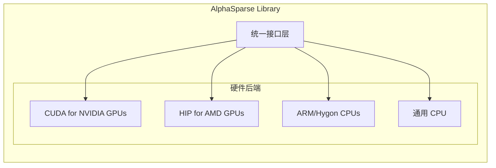

**图 1：AlphaSparse 跨平台架构示意图**

### NVIDIA GPU (CUDA)

项目包含专门为 NVIDIA GPU 设计的 CUDA 内核。构建系统通过 `CMakeLists.txt` 文件来管理 CUDA 相关的编译选项和依赖。例如，测试目标会链接 `CUDA::cudart` 和 `CUDA::cusparse`，并可以设置特定的计算能力（`CUDA_ARCH`）。

Sources: cuda/test/CMakeLists.txt:3-16

### AMD GPU (HIP)

为了支持 AMD GPU，项目使用了 HIP (Heterogeneous-compute Interface for Portability)。`hip/` 目录下包含了 HIP 内核的实现，例如 `ac-SpGEMM` 算法。这种方法使得代码可以从类似 CUDA 的语法编译到 AMD 的 ROCm 平台。

Sources: hip/kernel/level3/ac/MultiplyKernels.h, hip/kernel/level3/ac/acSpGEMM_MergeMaxChunks.h

### ARM & Hygon CPU

项目同样为特定的 CPU 架构（如 ARM 和 Hygon）提供了优化。`arm/test/CMakeLists.txt` 和 `hygon/kernel/` 等文件表明存在针对这些平台的特定构建目标和内核代码。

Sources: arm/test/CMakeLists.txt:19-25, hygon/kernel/level2/mv/symv/symv_bsr_u_lo_conj.hpp

## SpGEMM 算法详解 (ac-SpGEMM)

ac-SpGEMM 是一种高效的稀疏矩阵-矩阵乘法算法，在 `hip/` 和 `cuda/` 目录中有详细实现。该算法的核心思想是将复杂的乘法任务分解为多个更小的 “chunk”，然后对这些 chunk 进行合并以生成最终结果行。

Sources: hip/kernel/level3/ac/MultiplyKernels.h:43-49

### 合并策略

为了处理不同密度和大小的中间结果，ac-SpGEMM 实现了多种合并策略。这些策略在内核启动时被动态选择和分配。

1. **Simple Merge**: 用于处理 chunk 数量较少的情况。
2. **Max Chunks Merge**: 当一个结果行由大量（超过阈值）的 chunk 构成时使用。这种情况下，算法采用一种多轮迭代的方式，通过采样和路径选择来逐步合并数据，避免一次性加载过多数据导致内存溢出或性能下降。
3. **Generalized Merge**: 一种更通用的合并策略，用于处理最复杂的情况。

下面的流程图展示了在处理一个需要合并的行时，系统如何根据 chunk 的数量和元素总数来选择不同的合并内核。

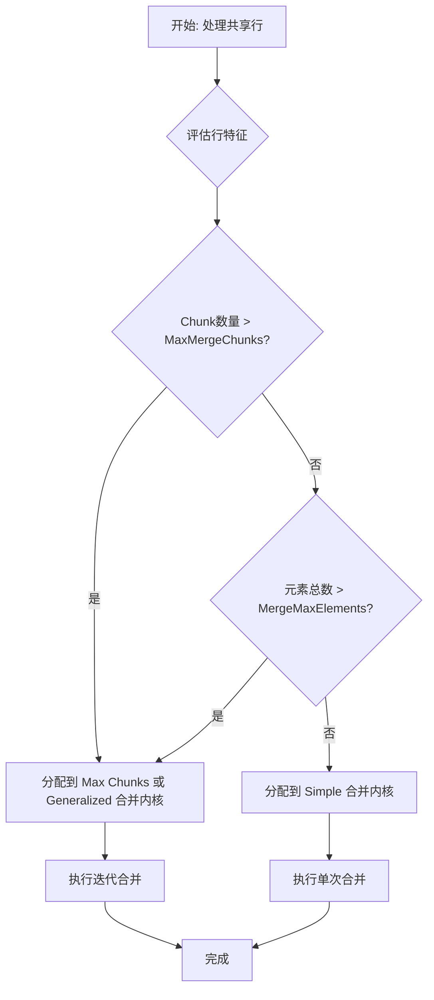

**图 2：ac-SpGEMM 合并策略选择流程**

Sources: hip/kernel/level3/ac/HelperFunctions.h:116-121, hip/kernel/level3/ac/MultiplyKernels.h:55-73

`mergeSharedRowsMaxChunks` 内核是 “Max Chunks” 策略的核心实现。它通过一个循环不断处理数据，直到所有元素都被合并。在每次迭代中，它会对 chunk 的索引进行采样，估算不同合并路径的成本（即生成的元素数量），并选择一个不会超出线程处理能力的最佳路径来执行合并。如果找不到合适的路径，它会采取一种 “halve step” 策略，即选择一个中间列索引作为分割点，强制减少工作量。

Sources: hip/kernel/level3/ac/acSpGEMM_MergeMaxChunks.h:184-299

## 数据结构与矩阵格式

AlphaSparse 支持多种业界标准的稀疏矩阵存储格式，以适应不同矩阵结构和算法的需求。

| 格式 | 全称 | 描述 |
| --- | --- | --- |
| **CSR** | Compressed Sparse Row | 按行压缩存储，包含三个数组：值、列索引和行偏移。 |
| **CSC** | Compressed Sparse Column | 按列压缩存储，与 CSR 类似但以列为主。 |
| **DIA** | Diagonal | 对角线格式，适用于对角线元素密集的矩阵。 |
| **BSR** | Block Sparse Row | 块压缩稀疏行，将矩阵划分为固定大小的块进行存储。 |

Sources: include/alphasparse/kernel_plain/kernel_csr_c.h, include/alphasparse/kernel_plain/kernel_csc_c.h, include/alphasparse/kernel_plain/kernel_dia_c.h, hygon/kernel/level2/mv/symv/symv_bsr_u_lo_conj.hpp

## 构建与测试系统

项目使用 CMake 作为构建系统。`CMakeLists.txt` 文件定义了如何为不同平台编译和链接测试程序。

一个名为 `add_alphasparse_example` 的 CMake 函数被用来简化测试用例的创建。该函数负责：
1. 从源文件名派生可执行目标名。
2. 添加必要的头文件目录。
3. 创建可执行文件。
4. 链接核心的 `alphasparse` 库以及平台相关的依赖项（如 CUDA 的 `cudart` 或 ARM 的 `m` 和 `dl`）。
5. 为 GPU 平台设置目标架构（如 `CUDA_ARCHITECTURES`）。

```
# arm/test/CMakeLists.txt 中的示例function(add_alphasparse_example TEST_SOURCE)
  get_filename_component(TEST_TARGET ${TEST_SOURCE} NAME_WE)
  include_directories(./include)
  add_executable(${TEST_TARGET} ${TEST_SOURCE})
  target_include_directories(${TEST_TARGET} PRIVATE $<BUILD_INTERFACE:${PROJECT_SOURCE_DIR}/include>)
  # Linker dependencies  target_link_libraries(${TEST_TARGET} PUBLIC      alphasparse
      m
      dl
      )
endfunction()
add_alphasparse_example(level3/spmm_hygon_test.cpp)
```

**代码片段 1：用于 ARM 平台的 CMake 测试用例定义**

Sources: arm/test/CMakeLists.txt:1-17,23, cuda/test/CMakeLists.txt:1-16

---

## 快速入门

### Related Pages

Related topics: [构建系统](about:blank#page-9)

- Relevant source files
    
    The following files were used as context for generating this wiki page:
    
    - [arm/test/CMakeLists.txt](arm/test/CMakeLists.txt)
    - [cuda/test/CMakeLists.txt](cuda/test/CMakeLists.txt)
    - [hip/test/include/args.h](hip/test/include/args.h)
    - [hygon/test/include/args.h](hygon/test/include/args.h)
    - [hip/kernel/level3/ac/MultiplyKernels.h](hip/kernel/level3/ac/MultiplyKernels.h)
    - [cuda/kernel/level3/ac/MultiplyKernels.h](cuda/kernel/level3/ac/MultiplyKernels.h)
    - [plain/kernel/level2/mv/trmv/trmv_bsr_u_hi_conj_plain.hpp](plain/kernel/level2/mv/trmv/trmv_bsr_u_hi_conj_plain.hpp)
    - [include/alphasparse/kernel_plain/kernel_csr_c.h](include/alphasparse/kernel_plain/kernel_csr_c.h)
    - [hip/kernel/level3/ac/acSpGEMM_MergeMaxChunks.h](hip/kernel/level3/ac/acSpGEMM_MergeMaxChunks.h)

# 快速入门

AlphaSPARSE 是一个高性能的稀疏基础线性代数子程序（BLAS）库，旨在为多种硬件架构提供优化的稀疏计算能力，包括 CPU（如 ARM, Hygon）和 GPU（如 CUDA, HIP/DCU）。本指南将介绍项目的基本架构、如何构建和运行测试用例，以及库的核心功能，帮助开发者快速上手。

## 项目架构

AlphaSPARSE 的代码库根据目标硬件平台进行了模块化组织。每个平台都在其专用目录下包含独立的内核实现和测试代码。这种结构使得代码易于维护，并能针对特定硬件进行深度优化。

Sources: arm/test/CMakeLists.txt, cuda/test/CMakeLists.txt, hip/kernel/level3/ac/MultiplyKernels.h, plain/kernel/level2/mv/trmv/trmv_bsr_u_hi_conj_plain.hpp

### 目录结构

项目的主要目录按目标平台划分，核心目录结构如下：

- `arm/`: 适用于 ARM 架构的实现。
- `cuda/`: 适用于 NVIDIA CUDA 平台的实现。
- `hip/`: 适用于 AMD HIP 平台的实现。
- `hygon/`: 适用于海光 CPU 架构的实现。
- `plain/`: 平台无关的通用 C/C++ 实现，作为基准或后备。
- `include/`: 包含库的公共头文件和 API 定义。

每个平台目录下通常包含 `kernel` 和 `test` 两个子目录，分别存放计算内核和对应的测试代码。

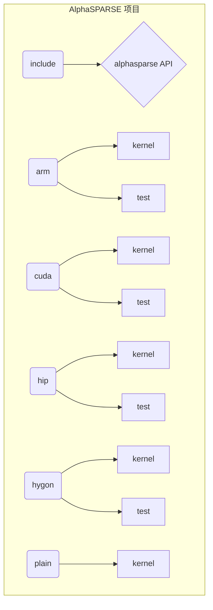

**图 1：AlphaSPARSE 项目目录结构**
Sources: arm/test/CMakeLists.txt, cuda/test/CMakeLists.txt, hip/test/include/args.h

## 构建与测试

项目使用 CMake 作为构建系统。测试用例的编译配置清晰地展示了如何链接 AlphaSPARSE 库以及其对不同平台特定库的依赖关系。

Sources: arm/test/CMakeLists.txt, cuda/test/CMakeLists.txt

### CMake 构建配置

通过 `CMakeLists.txt` 文件中的 `add_alphasparse_example` 函数来定义和编译测试用例。该函数封装了添加可执行文件、包含头文件目录和链接库的逻辑。

下面是不同平台的构建流程和依赖项：

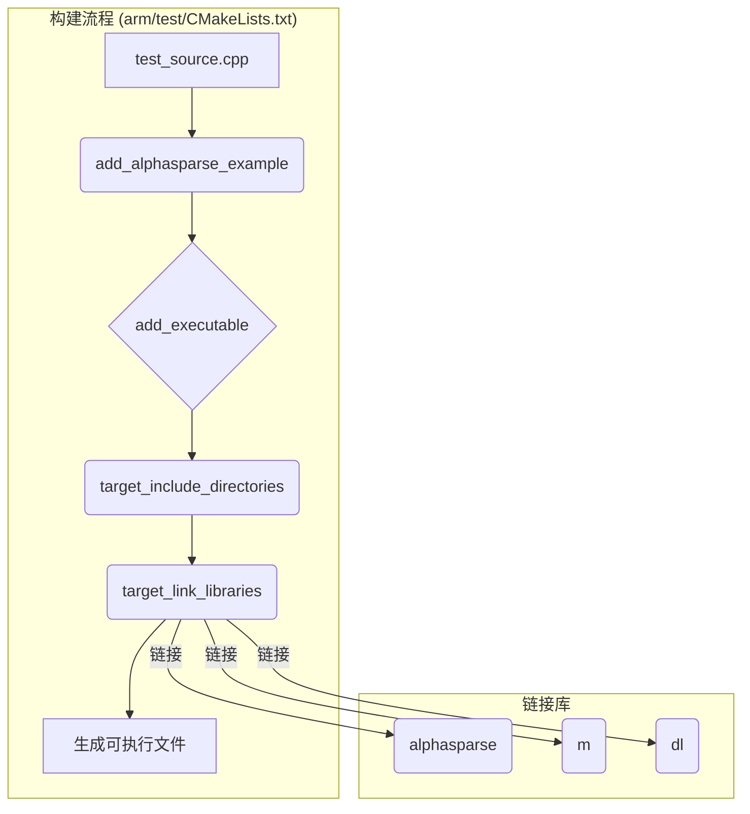

**图 2：ARM 平台测试用例构建流程**
Sources: arm/test/CMakeLists.txt:1-21

对于 CUDA 平台，依赖项有所不同，需要链接 CUDA 相关的库。

| 平台 | 主要依赖库 |
| --- | --- |
| ARM | `alphasparse`, `m`, `dl` |
| CUDA | `CUDA::cudart`, `CUDA::cusparse`, `alphasparse` |

**表 1：不同平台的链接依赖**
Sources: arm/test/CMakeLists.txt:15-19, cuda/test/CMakeLists.txt:13-19

## 运行测试用例

编译生成的可执行测试文件支持通过命令行参数进行配置，以适应不同的测试场景，如指定输入数据、开启结果校验、设置迭代次数等。

Sources: hip/test/include/args.h, hygon/test/include/args.h

### 命令行参数

通过分析测试目录下的 `args.h` 头文件，可以了解支持的通用命令行选项。

| 参数 | 描述 | 默认值 |
| --- | --- | --- |
| `--check` | 是否进行结果校验。 | `false` |
| `--warmup` | 是否进行预热运行。 | `1` (HIP) / `false` (Hygon) |
| `--iter` | 指定测试的迭代次数。 | `1` |
| `--data-file` | 指定输入数据文件的路径。 | `""` (空字符串) |
| `--layout` | 指定矩阵的内存布局（行主序或列主序）。 | `ALPHA_SPARSE_LAYOUT_ROW_MAJOR` |
| `--op` | 指定稀疏矩阵操作类型（如非转置、转置）。 | `ALPHA_SPARSE_OPERATION_NON_TRANSPOSE` |
| `--format` | 指定稀疏矩阵的存储格式。 | `ALPHA_SPARSE_FORMAT_CSR` |
| `--data-type` | 指定数据类型。 | `ALPHA_R_32F` (HIP) / `ALPHA_SPARSE_DATATYPE_FLOAT` (Hygon) |

**表 2：通用测试用例命令行参数**
Sources: hip/test/include/args.h:12-20, hygon/test/include/args.h:14-22

## 核心功能概览

AlphaSPARSE 库的核心是提供跨平台的稀疏 BLAS 例程，涵盖 Level 2 和 Level 3 的操作，并针对特定硬件进行了深度优化。

### 稀疏 BLAS 例程

库提供了丰富的稀疏计算函数，例如：

- **Level 2**:
    - `gemv`: 通用稀疏矩阵向量乘法。
    - `symv`: 对称稀疏矩阵向量乘法。
    - `trmv`: 三角稀疏矩阵向量乘法。
    - `trsv`: 三角稀疏方程求解。
- **Level 3**:
    - `gemm`: 通用稀疏矩阵乘法 (SpGEMM)。
    - `spsm`: 稀疏方程组求解。

这些函数的接口在 `include/alphasparse/kernel_plain/` 目录下的头文件中声明，具体实现则分布在各个平台的 `kernel` 目录中。例如，`plain` 后端为复数 CSR 矩阵提供了 `symv_c_csr_n_lo_plain` 等函数。

Sources: include/alphasparse/kernel_plain/kernel_csr_c.h:18-21, plain/kernel/level2/mv/trmv/trmv_bsr_u_hi_conj_plain.hpp

### 高级功能：SpGEMM

对于复杂的 Level 3 操作，如 SpGEMM，AlphaSPARSE 在 GPU 平台上采用了先进的算法。`AcSpGEMMKernels` 类是 HIP 和 CUDA 平台上 SpGEMM 实现的核心。它根据计算负载的特性，动态选择不同的合并（Merge）策略来处理中间结果，以达到最优性能。

主要的合并策略包括：
* **Simple Merge**: 适用于中间结果较少、可以直接在共享内存中处理的简单情况。
* **Max Chunks Merge**: 针对中间结果分块（Chunks）数量在可控范围内的场景，通过多路归并进行优化。
* **Generalized Merge**: 适用于最复杂的情况，当分块数量或数据量超过硬件限制时，采用更通用的、可扩展的合并算法。

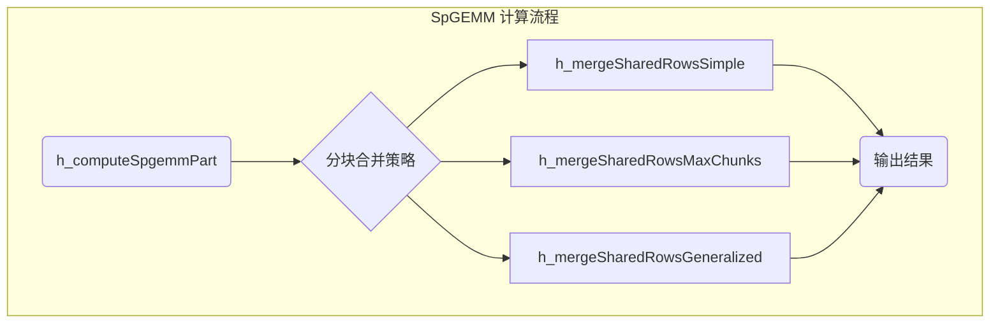

**图 3：GPU 上的 SpGEMM 合并策略**
Sources: hip/kernel/level3/ac/MultiplyKernels.h:80-108, cuda/kernel/level3/ac/MultiplyKernels.h:80-99

这些策略的选择和实现体现了 AlphaSPARSE 在高性能计算领域的深度优化。例如，`mergeSharedRowsMaxChunks` 内核使用分块采样和路径编码等复杂技术来高效地并行合并数据。

Sources: hip/kernel/level3/ac/acSpGEMM_MergeMaxChunks.h:91-115

## 总结

本快速入门指南概述了 AlphaSPARSE 库的架构、构建测试流程和核心功能。通过其模块化的多平台设计，AlphaSPARSE 为开发者提供了一个功能强大且高度优化的稀疏计算工具集。开发者可以利用本文档中的信息，开始编译和运行示例，并进一步探索其丰富的稀疏 BLAS 功能。

---

## 多平台架构设计

### Related Pages

Related topics: [项目简介](about:blank#page-1), [API 设计理念](about:blank#page-4)

- Relevant source files
    
    以下文件被用作生成此维基页面的上下文：
    
    - [arm/test/CMakeLists.txt](arm/test/CMakeLists.txt)
    - [cuda/test/CMakeLists.txt](cuda/test/CMakeLists.txt)
    - [hip/test/CMakeLists.txt](hip/test/CMakeLists.txt)
    - [hygon/test/CMakeLists.txt](hygon/test/CMakeLists.txt)
    - [hip/kernel/level3/ac/acSpGEMM_MergeMaxChunks.h](hip/kernel/level3/ac/acSpGEMM_MergeMaxChunks.h)
    - [cuda/test/include/args.h](cuda/test/include/args.h)
    - [hip/test/include/args.h](hip/test/include/args.h)
    - [include/alphasparse/kernel_dcu/kernel_csr_c_dcu.h](include/alphasparse/kernel_dcu/kernel_csr_c_dcu.h)
    - [include/alphasparse/kernel_plain/kernel_csr_c.h](include/alphasparse/kernel_plain/kernel_csr_c.h)
    - [hip/test/include/common.h](hip/test/include/common.h)

# 多平台架构设计

AlphaSPARSE 库被设计为一个高性能的稀疏基础线性代数子程序（BLAS）库，其核心特性之一是支持多种硬件平台。该架构通过模块化的目录结构、平台特定的内核实现和统一的编译系统，实现了在 CPU（如 ARM、Hygon）和 GPU（如 NVIDIA CUDA、AMD HIP）上的可移植性和高性能。

该设计确保了顶层 API 的一致性，同时允许底层根据不同硬件的特性进行深度优化。测试框架也针对各个平台进行了适配，以验证其正确性和性能。

## 核心架构概览

项目通过独立的目录来组织不同平台的代码，这种结构使得平台之间的依赖关系清晰，便于独立开发和维护。

下面的图表展示了项目的高层目录结构：

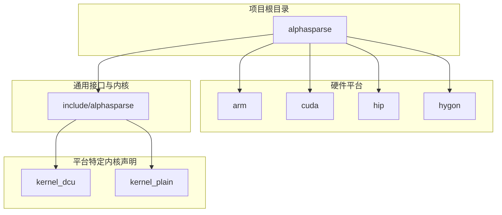

- **平台目录 (`arm/`, `cuda/`, `hip/`, `hygon/`)**: 每个目录包含对应平台的特定实现、测试代码和构建脚本。
- **通用头文件 (`include/alphasparse`)**: 定义了库的公共 API、数据结构（如 `spmat`）以及不同后端的内核函数声明。
- **内核声明目录 (`kernel_dcu/`, `kernel_plain/`)**: `kernel_dcu` 包含用于 AMD GPU (HIP/DCU) 的内核接口，而 `kernel_plain` 包含用于 CPU 的通用 C 语言内核接口。

Sources: arm/test/CMakeLists.txt, cuda/test/CMakeLists.txt, hip/test/CMakeLists.txt, hygon/test/CMakeLists.txt, include/alphasparse/kernel_dcu/kernel_csr_c_dcu.h, include/alphasparse/kernel_plain/kernel_csr_c.h

## 编译与构建系统

项目使用 CMake 作为构建系统，并为每个平台提供了独立的 `CMakeLists.txt` 文件来管理编译和链接过程。通过定义一个名为 `add_alphasparse_example` 的通用函数，简化了为不同平台添加测试可执行文件的过程。

### CUDA 平台构建

CUDA 平台的测试构建过程在 `cuda/test/CMakeLists.txt` 中定义。它为每个测试目标指定了 CUDA 相关的编译定义和库链接。

```
# cuda/test/CMakeLists.txt:1-17function(add_alphasparse_example TEST_SOURCE)
  get_filename_component(TEST_TARGET ${TEST_SOURCE} NAME_WE)
  add_executable(${TEST_TARGET} ${TEST_SOURCE})
  target_compile_definitions(${TEST_TARGET} PUBLIC __CUDA_NO_HALF2_OPERATORS__)
  target_compile_definitions(${TEST_TARGET} PUBLIC CUDA_ARCH=${CUDA_ARCH})
  set_property(TARGET ${TEST_TARGET} PROPERTY CUDA_ARCHITECTURES ${CUDA_ARCH})
  # Include common client headers  target_include_directories(${TEST_TARGET} PRIVATE $<BUILD_INTERFACE:${PROJECT_SOURCE_DIR}/include>)
  # Linker dependencies  target_link_libraries(${TEST_TARGET} PUBLIC      CUDA::cudart      CUDA::cudart_static      CUDA::cusparse      CUDA::cusparse_static      alphasparse
    )
endfunction()
```

| 配置项 | 值/描述 |
| --- | --- |
| `target_compile_definitions` | `__CUDA_NO_HALF2_OPERATORS__`, `CUDA_ARCH=${CUDA_ARCH}` |
| `CUDA_ARCHITECTURES` | `${CUDA_ARCH}` (例如: 80) |
| `target_link_libraries` | `CUDA::cudart`, `CUDA::cusparse`, `alphasparse` |

Sources: cuda/test/CMakeLists.txt:1-20

### HIP/DCU 平台构建

HIP 平台的构建配置位于 `hip/test/CMakeLists.txt`。它链接了 ROCm/HIP 相关的库，如 `roc::hipsparse` 和 `roc::rocprim`。此外，它还创建了一个对象库 `alphasparse_hip_test_utils_objs` 来共享通用的测试辅助代码。

| 配置项 | 值/描述 |
| --- | --- |
| `target_compile_definitions` | `__HIP_PLATFORM_HCC__`, `CUDA_ARCH=${CUDA_ARCH}` |
| `CUDA_ARCHITECTURES` | `${CUDA_ARCH}` |
| `target_link_libraries` | `roc::hipsparse`, `hip::host`, `hip::device`, `roc::rocprim`, `alphasparse` |
| 共享对象库 | `alphasparse_hip_test_utils_objs` |

Sources: hip/test/CMakeLists.txt:1-38

### CPU 平台构建 (ARM & Hygon)

ARM 和 Hygon 平台共享相似的 CPU 构建流程，但链接的库有所不同。

### ARM 平台

ARM 平台的测试仅链接了核心的 `alphasparse` 库以及标准的 `m` 和 `dl` 库。

```
# arm/test/CMakeLists.txt:11-15  target_link_libraries(${TEST_TARGET} PUBLIC      alphasparse
      m
      dl
      )
```

Sources: arm/test/CMakeLists.txt:1-18

### Hygon 平台

Hygon 平台则链接了 Intel MKL 库 (`mkl_intel_lp64`, `mkl_core` 等) 和 OpenMP (`iomp5`) 以利用其 x86 架构的性能优势。值得注意的是，如果启用了 `ALPHA_BUILD_HIP` 标志，Hygon 测试还会链接 HIP 库，表明它支持在 Hygon 平台上与 GPU 进行混合编程或测试。

```
# hygon/test/CMakeLists.txt:7-15  target_link_libraries(${TEST_TARGET} PUBLIC      alphasparse
      mkl_intel_lp64
      mkl_intel_thread
      mkl_core
      iomp5
      m
      dl
  )
```

Sources: hygon/test/CMakeLists.txt:1-21

## 内核实现与抽象

架构通过分离接口声明和平台实现来提供抽象。`include/alphasparse` 目录下的头文件定义了不同后端的内核函数原型。

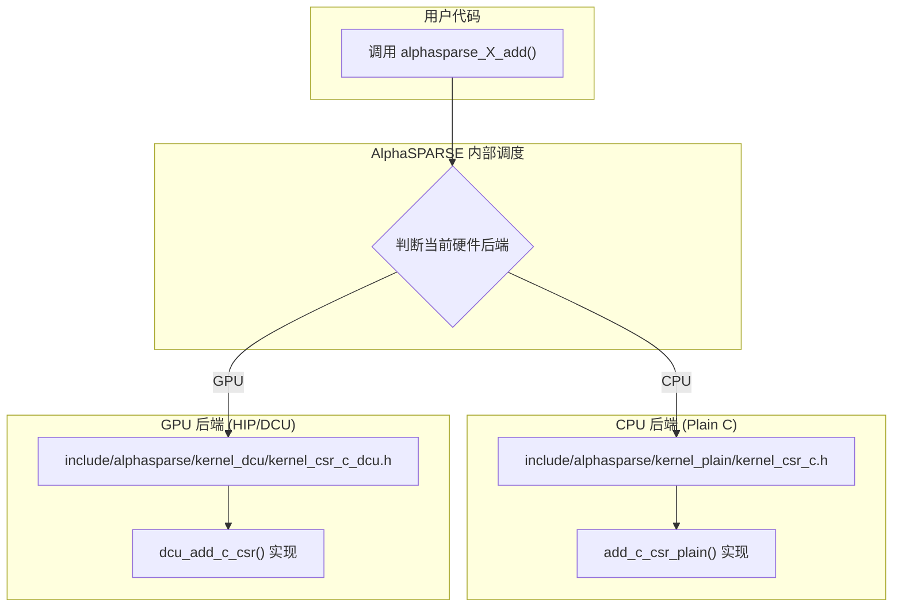

例如，针对 CSR 格式的复数矩阵操作，CPU 和 DCU 的内核声明分别位于不同的头文件中：
- **CPU (Plain C)**: `include/alphasparse/kernel_plain/kernel_csr_c.h` 中声明了 `add_c_csr_plain` 等函数。
- **GPU (DCU)**: `include/alphasparse/kernel_dcu/kernel_csr_c_dcu.h` 中声明了 `dcu_hermv_c_csr_n_hi_trans` 等以 `dcu_` 为前缀的函数。

这种分离使得上层调用者无需关心底层的具体实现，库内部会根据当前激活的硬件后端来调度正确的内核函数。

Sources: include/alphasparse/kernel_plain/kernel_csr_c.h:3-5, include/alphasparse/kernel_dcu/kernel_csr_c_dcu.h:3-5

## 测试框架与参数解析

为了在不同平台上进行一致的测试，项目为 CUDA 和 HIP 提供了相似的命令行参数解析功能。

头文件 `cuda/test/include/args.h` 和 `hip/test/include/args.h` 定义了一系列函数，用于从命令行参数中获取测试配置。

| 函数 | 描述 | 存在于 |
| --- | --- | --- |
| `args_get_if_check` | 获取是否进行正确性检查的标志 | CUDA, HIP |
| `args_get_if_warm` | 获取是否进行预热的标志 | CUDA, HIP |
| `args_get_iter` | 获取迭代次数 | CUDA, HIP |
| `args_get_data_file` | 获取输入数据文件名 | CUDA, HIP |
| `alpha_args_get_layout` | 获取矩阵布局 (行主序/列主序) | CUDA, HIP |
| `alpha_args_get_transA` | 获取矩阵 A 的转置操作类型 | CUDA, HIP |
| `alpha_args_get_data_type` | 获取数据类型 | CUDA, HIP |

这种标准化的参数解析使得测试脚本可以轻松地在不同 GPU 平台上复用。同时，`hip/test/include/common.h` 文件中定义了 AlphaSPARSE 枚举类型到 HIPSPARSE 枚举类型的映射（例如 `alpha2cuda_op_map`），这对于与原生库进行性能或正确性对比至关重要。

Sources: cuda/test/include/args.h:20-80, hip/test/include/args.h:20-80, hip/test/include/common.h:42-46

## 平台特定代码示例

在平台特定的目录中，包含了针对硬件深度优化的代码。一个典型的例子是 `hip/kernel/level3/ac/acSpGEMM_MergeMaxChunks.h`，这是一个用于稀疏矩阵乘法（SpGEMM）的 HIP 内核文件。

该文件展示了 GPU 编程的复杂性：
- **GPU 特定关键字**: 使用 `__global__` 定义内核入口点，`__device__` 和 `__forceinline__` 定义设备端函数。
- **线程协作**: 通过 `__syncthreads()` 进行块内线程同步。
- **第三方库集成**: 利用 `hipcub::BlockRadixSort` 和 `hipcub::BlockScan` 等高性能基元进行块内排序和扫描操作。
- **调试宏**: 定义了 `ROW_TO_INVESTIGATE` 等宏，用于在调试时追踪特定矩阵行的计算过程，这对于调试复杂的并行算法至关重要。

```cpp
// hip/kernel/level3/ac/acSpGEMM_MergeMaxChunks.h:182-187#pragma unroll            for (uint32_t i = 0; i < LengthSamplesPerThread; ++i)            {                uint32_t lid = i*THREADS + threadIdx.x;                uint32_t chunk = lid / (MERGE_MAX_PATH_OPTIONS + 1);                uint32_t sample = lid - chunk * (MERGE_MAX_PATH_OPTIONS + 1);
```

这段代码展示了在 GPU 线程中进行复杂索引计算和数据采样的逻辑，这是在不同硬件平台上实现高性能所必需的底层优化。

Sources: hip/kernel/level3/ac/acSpGEMM_MergeMaxChunks.h:81-280, hip/kernel/level3/ac/MultiplyKernels.h:35-36

## 结论

AlphaSPARSE 的多平台架构设计通过清晰的目录结构、可配置的 CMake 构建系统以及内核抽象层，成功地实现了代码在多种 CPU 和 GPU 硬件上的可移植性。该架构不仅支持平台特定的深度优化，还通过统一的测试框架确保了各个版本的可靠性和一致性。这种模块化和可扩展的设计为未来支持更多新型硬件平台奠定了坚实的基础。

---

## API 设计理念

### Related Pages

Related topics: [多平台架构设计](about:blank#page-3), [BLAS 等级函数](about:blank#page-6)

- Relevant source files
    
    以下文件被用作生成此维基页面的上下文：
    
    - [hip/test/include/args.h](hip/test/include/args.h)
    - [cuda/test/include/args.h](cuda/test/include/args.h)
    - [dcu/test/include/args.h](dcu/test/include/args.h)
    - [arm/test/include/args.h](arm/test/include/args.h)
    - [hygon/test/include/args.h](hygon/test/include/args.h)
    - [include/alphasparse/kernel_plain/kernel_csr_c.h](include/alphasparse/kernel_plain/kernel_csr_c.h)
    - [include/alphasparse/kernel_dcu/kernel_bsr_z_dcu.h](include/alphasparse/kernel_dcu/kernel_bsr_z_dcu.h)
    - [arm/test/CMakeLists.txt](arm/test/CMakeLists.txt)

# API 设计理念

AlphaSPARSE 是一个为在多种硬件平台上实现高性能而设计的稀疏线性代数库。其 API 设计理念的核心是为针对 x86、ARM、CUDA、HIP 和 DCU 等不同架构的开发人员提供一致、清晰且易于使用的接口。该设计哲学借鉴了 BLAS（基础线性代数子程序）的成功经验，并在此基础上进行了扩展，以适应稀疏计算的独特需求。

关键设计原则包括遵循标准化的函数命名约定、使用描述性枚举类型来定义矩阵属性，以及为所有后端提供统一的测试和基准测试框架。这种方法旨在降低学习成本，同时确保代码在不同平台间的可移植性和可维护性。

## 跨平台兼容性

AlphaSPARSE 的核心设计目标之一是支持多样化的计算硬件。项目结构清晰地反映了这一点，为每个目标平台（如 `cuda`、`hip`、`dcu`、`arm`、`hygon`）都设有专门的目录。这种模块化结构使得添加新的硬件后端或优化特定平台的实现变得更加容易。

API 在不同平台间保持了高度的一致性。例如，用于测试程序的命令行参数解析头文件（`args.h`）在各个后端（`hip/test/include/args.h`、`cuda/test/include/args.h` 等）中具有几乎相同的接口和功能。这表明库提供了一个通用的测试框架，简化了在不同硬件上进行性能验证和基准测试的流程。

此外，该库还考虑了与其他数值计算库（如 Intel MKL）的互操作性。通过在代码中使用预处理器指令（如 `#ifdef __MKL__`），API 设计允许有条件地包含和链接外部库，便于性能比较和功能验证。

*Sources: hip/test/include/args.h:87, dcu/test/include/args.h:78, hygon/test/include/args.h:78, arm/test/CMakeLists.txt:1-12*

## API 命名约定

为了提高可读性和可预测性，AlphaSPARSE 的函数命名严格遵循一套类似于 BLAS 的约定。函数名称由多个部分组成，每个部分都描述了操作的一个特定方面，如目标后端、操作类型、数据类型、矩阵格式和操作属性。

一个典型的函数名称结构如下：
`[后端]_[操作]_[数据类型]_[格式]_[属性]_[实现]`

下面是一个具体的例子，`dcu_trmv_z_bsr_u_hi_conj`：
- **dcu_**: 后端前缀，表示该函数是为 DCU 平台实现的。对于通用的 CPU 实现，此前缀可能被省略。
- **trmv**: 操作名称，表示“三角矩阵-向量乘法”。
- **z**: 数据类型，表示双精度复数 (`ALPHA_Complex16`)。
- **bsr**: 稀疏矩阵格式，表示“块压缩稀疏行”（Block Sparse Row）。
- **u_hi_conj**: 操作属性的组合。
- `u`: 对角线类型，表示对角线为单位对角线（Unit diagonal）。
- `hi`: 填充模式，表示操作仅涉及矩阵的上三角部分（Upper part）。
- `conj`: 操作变体，表示执行共轭操作。

下表总结了命名约定的各个组成部分：

| 组件 | 描述 | 示例 | 来源文件 |
| --- | --- | --- | --- |
| **后端** | 指定函数的目标硬件平台。对于平台无关的 CPU 实现，此部分通常省略。 | `dcu_`, `(none)` | `include/alphasparse/kernel_dcu/kernel_bsr_z_dcu.h` |
| **操作** | 定义要执行的线性代数运算。 | `gemv`, `symv`, `trmv`, `trsm`, `add` | `include/alphasparse/kernel_plain/kernel_csr_c.h` |
| **数据类型** | 指定矩阵和向量中使用的数据类型。 | `s` (float), `d` (double), `c` (complex float), `z` (complex double) | `include/alphasparse/kernel_dcu/kernel_bsr_z_dcu.h` |
| **格式** | 指定稀疏矩阵的存储格式。 | `csr`, `bsr`, `dia`, `gebsr` | `include/alphasparse/kernel_plain/kernel_dia_c.h` |
| **属性** | 描述操作的附加特性，如转置、共轭、填充模式或对角线类型。 | `trans`, `conj`, `n_lo` (Non-unit, Lower), `u_hi` (Unit, Upper) | `plain/kernel/level2/mv/trmv/trmv_bsr_u_hi_conj_plain.hpp` |
| **实现** | 标识具体的实现版本，例如通用的 `plain` CPU 实现。 | `_plain` | `include/alphasparse/kernel_plain/kernel_bsr_c.h` |

*Sources: include/alphasparse/kernel_dcu/kernel_bsr_z_dcu.h:25, include/alphasparse/kernel_plain/kernel_csr_c.h:12, include/alphasparse/kernel/kernel_dia_c.h:12*

## 数据结构与枚举

为了增强类型安全性和代码清晰度，API 广泛使用枚举类型（`enum`）和结构体（`struct`）来定义和传递参数，而不是依赖于易于出错的魔术数字或字符串。

### 关键枚举类型

API 定义了一系列枚举类型来描述矩阵的布局、格式、数据类型和操作。这些类型是函数接口的核心部分，确保了参数的有效性和一致性。

| 枚举类型 | 描述 | 默认值 | 来源文件 |
| --- | --- | --- | --- |
| `alphasparse_layout_t` | 定义密集矩阵（如 BSR 格式中的块）或稠密向量的内存布局。 | `ALPHA_SPARSE_LAYOUT_ROW_MAJOR` | `hip/test/include/args.h:14` |
| `alphasparseFormat_t` | 指定稀疏矩阵的存储格式。 | `ALPHA_SPARSE_FORMAT_CSR` | `hip/test/include/args.h:18` |
| `alphasparseDataType` | 指定矩阵元素的数据类型。 | `ALPHA_R_32F` | `hip/test/include/args.h:19` |
| `alphasparseOperation_t` | 指定在操作中是否对矩阵进行转置或共轭转置。 | `ALPHA_SPARSE_OPERATION_NON_TRANSPOSE` | `hip/test/include/args.h:15` |
| `alphasparse_matrix_type_t` | 描述矩阵的结构属性，如对称、三角等。 | N/A | `hip/test/include/args.h:26` |
| `alphasparse_fill_mode_t` | 指定是使用矩阵的上三角部分还是下三角部分。 | N/A | `hip/test/include/args.h:27` |
| `alphasparse_diag_type_t` | 指定三角矩阵的对角线是单位对角线还是非单位对角线。 | N/A | `hip/test/include/args.h:28` |

*Sources: hip/test/include/args.h:14-19, cuda/test/include/args.h:15-21, dcu/test/include/args.h:14-20*

### 矩阵描述符

为了简化 API 调用，相关的矩阵属性（如矩阵类型、填充模式和对角线类型）被封装在一个名为 `alpha_matrix_descr` 的结构体中。这种方法减少了函数参数的数量，并将相关的属性组合在一起，使得 API 更加简洁和易于管理。测试框架中提供了辅助函数 `alpha_args_get_matrix_descr_helper` 来从命令行参数方便地构造此描述符。

*Sources: hip/test/include/args.h:70, cuda/test/include/args.h:70*

## 参数解析与测试框架

AlphaSPARSE 的设计高度重视测试和基准测试。项目为每个后端提供了一套统一的命令行参数解析工具，这些工具定义在各自的 `args.h` 头文件中。这个共享框架确保了所有测试程序都接受一组一致的输入参数，从而极大地简化了跨不同硬件平台的性能评估和结果验证。

### 通用测试参数

测试程序可以通过命令行标志来配置，常见的参数包括：
- **数据文件**: 使用 `--fileA`、`--fileB` 等指定输入矩阵文件的路径。
- **迭代次数**: 使用 `--iter` 控制性能测试的迭代次数。
- **结果验证**: 使用 `--check` 标志启用或禁用计算结果的正确性验证。
- **预热运行**: 使用 `--warmup` 指定在正式计时前执行的预热迭代次数。
- **矩阵属性**: 通过 `--transA`、`--layout` 等参数设置矩阵的操作和内存布局。

*Sources: hip/test/include/args.h:32-65, cuda/test/include/args.h:35-65*

### 测试执行流程

下图展示了一个典型的测试程序从执行到完成的流程，突出了参数解析和内核调用之间的交互。

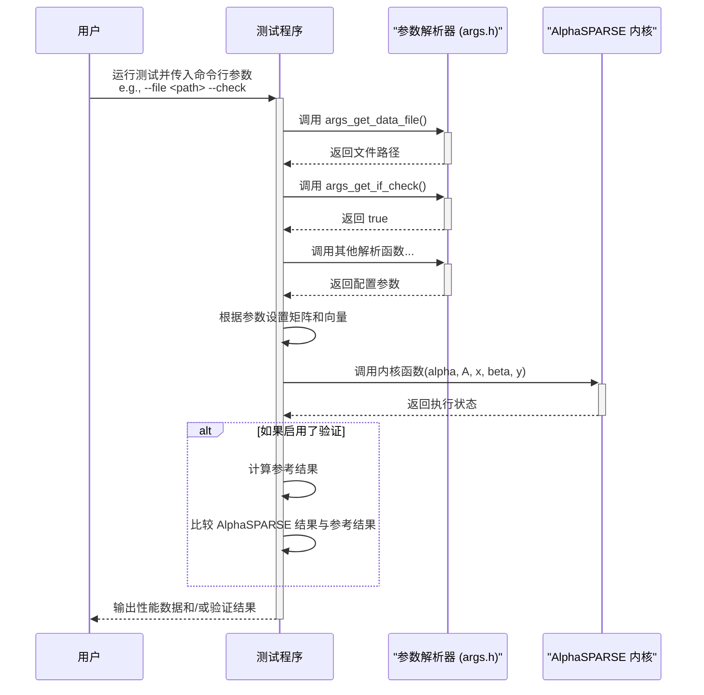

这个标准化的流程确保了在 AlphaSPARSE 支持的任何硬件上，测试和评估都遵循相同的方法，从而保证了结果的可比性和可靠性。

*Sources: hip/test/include/args.h, cuda/test/include/args.h, dcu/test/include/args.h*

---

## 稀疏矩阵格式

### Related Pages

Related topics: [BLAS 等级函数](about:blank#page-6)

- Relevant source files
    
    以下是用于生成此维基页面的上下文文件：
    
    - [hip/test/include/args.h](hip/test/include/args.h)
    - [cuda/test/include/args.h](cuda/test/include/args.h)
    - [include/alphasparse/kernel_plain/kernel_csr_c.h](include/alphasparse/kernel_plain/kernel_csr_c.h)
    - [include/alphasparse/kernel_plain/kernel_bsr_c.h](include/alphasparse/kernel_plain/kernel_bsr_c.h)
    - [include/alphasparse/kernel_plain/kernel_dia_c.h](include/alphasparse/kernel_plain/kernel_dia_c.h)
    - [cuda/test/CMakeLists.txt](cuda/test/CMakeLists.txt)
    - [plain/kernel/level2/mv/trmv/trmv_bsr_u_hi_conj_plain.hpp](plain/kernel/level2/mv/trmv/trmv_bsr_u_hi_conj_plain.hpp)

# 稀疏矩阵格式

AlphaSPARSE 库支持多种稀疏矩阵存储格式，以优化不同结构稀疏矩阵的性能和内存使用。该库为每种格式提供了专门的内核函数集，并通过测试套件中的命令行参数来支持格式选择。

默认格式在测试框架中被指定为 CSR（Compressed Sparse Row）。选择合适的格式对于实现特定稀疏矩阵操作的最佳性能至关重要。

Sources: hip/test/include/args.h:13

## 支持的格式

该库通过其内核函数和测试用例明确支持多种格式。下表总结了从源代码中识别出的主要格式。

| 格式 | 全称 | 描述 | 主要源文件 |
| --- | --- | --- | --- |
| **CSR** | Compressed Sparse Row | 一种通用的、高效的行压缩格式。在测试套件中作为默认格式。 | `kernel_csr_c.h`, `args.h` |
| **BSR** | Block Sparse Row | 适用于具有密集子块模式的稀疏矩阵，可提高缓存利用率。 | `kernel_bsr_c.h`, `trmv_bsr_u_hi_conj_plain.hpp` |
| **COO** | Coordinate | 一种灵活的格式，通过存储每个非零元素的行、列和值来表示。 | `CMakeLists.txt` |
| **CSC** | Compressed Sparse Column | CSR 的列主序版本，适用于需要高效列访问的操作。 | `CMakeLists.txt` |
| **DIA** | Diagonal | 针对对角线结构或带状矩阵进行了优化。 | `kernel_dia_c.h` |
| **BELL** | Bell | 一种用于在 SIMD/SIMT 架构上进行优化的分块格式。 | `CMakeLists.txt` |

Sources: hip/test/include/args.h:13, include/alphasparse/kernel_plain/kernel_csr_c.h, include/alphasparse/kernel_plain/kernel_bsr_c.h, cuda/test/CMakeLists.txt:104, 134, 252

### CSR (Compressed Sparse Row)

CSR 是测试和示例代码中的默认格式。它通过三个数组来表示矩阵：一个用于非零值，一个用于列索引，一个用于行指针。该格式的内核函数通常以 `_csr_` 为后缀。

**代码示例：默认格式定义**

```c
#define DEFAULT_FORMAT ALPHA_SPARSE_FORMAT_CSR
```

Sources: hip/test/include/args.h:13, cuda/test/include/args.h:13

**相关内核函数：**
- `add_c_csr_plain`
- `gemv_c_csr_plain`
- `symv_c_csr_n_lo_plain`
- `hermv_c_csr_n_lo_plain`

Sources: include/alphasparse/kernel_plain/kernel_csr_c.h:5, 11, 17, 29

### BSR (Block Sparse Row)

BSR 格式通过将矩阵划分为固定大小的块来存储，对于具有密集子矩阵块的稀疏矩阵非常有效。BSR 矩阵结构包含块维度（`block_dim`）和块内元素布局（`block_layout`）等属性。

**代码示例：访问 BSR 结构属性**

```cpp
// 从 BSR 矩阵结构中获取块维度ALPHA_INT bs = A->block_dim;// 检查块内布局是行主序还是列主序if (A->block_layout == ALPHA_SPARSE_LAYOUT_ROW_MAJOR){    // ...}
```

Sources: plain/kernel/level2/mv/trmv/trmv_bsr_u_hi_conj_plain.hpp:14, 21

**相关内核函数：**
- `add_c_bsr_plain`
- `gemv_c_bsr_plain`
- `symv_c_bsr_n_lo_plain`
- `hermv_c_bsr_n_lo_plain`

Sources: include/alphasparse/kernel_plain/kernel_bsr_c.h:5, 11, 17, 29

### 其他格式 (COO, CSC, DIA, BELL)

虽然 CSR 和 BSR 在内核头文件中有详细的接口定义，但对 COO、CSC 和 BELL 等其他格式的支持可以从 CUDA 测试套件的 `CMakeLists.txt` 文件中得到证实。该文件为这些格式定义了专门的测试可执行文件。同样，DIA 格式也有其专属的内核头文件。

**代码示例：为不同格式添加测试**

```
# COO format testsadd_alphasparse_example(level2/spmv_coo_r_f32_test.cu)
add_alphasparse_example(level3/spmm_coo_r_f32_test.cu)
# CSC format testsadd_alphasparse_example(level2/spmv_csc_r_f32_test.cu)
add_alphasparse_example(level3/spmm_csc_col_r_f32_test.cu)
# BELL format testsadd_alphasparse_example(level3/spmm_bell_r_f32_test.cu)
```

Sources: cuda/test/CMakeLists.txt:104, 230, 134, 240, 252

**DIA 格式内核函数：**
- `add_c_dia_plain`
- `gemv_c_dia_plain`
- `symv_c_dia_n_lo_plain`

Sources: include/alphasparse/kernel_plain/kernel_dia_c.h:5, 11, 17

## 格式选择与解析

在测试环境中，用户可以通过命令行参数指定要使用的稀疏矩阵格式。`args.h` 头文件定义了用于解析这些参数的辅助函数。

下图展示了从命令行参数到内部格式枚举的解析流程。

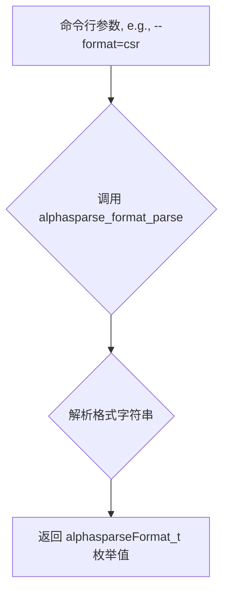

此流程允许测试程序动态地处理和测试不同的矩阵格式。

Sources: hip/test/include/args.h:19, cuda/test/include/args.h:21

## 内核接口

AlphaSPARSE 为不同的数据类型和稀疏格式提供了专门的内核函数。函数命名约定清晰地反映了其操作的格式。例如，对于复数类型的通用矩阵向量乘法（GEMV），不同格式的函数如下：

| 操作 | CSR 格式函数 | BSR 格式函数 | DIA 格式函数 |
| --- | --- | --- | --- |
| **GEMV** | `gemv_c_csr_plain` | `gemv_c_bsr_plain` | `gemv_c_dia_plain` |
| **SYM V** | `symv_c_csr_n_lo_plain` | `symv_c_bsr_n_lo_plain` | `symv_c_dia_n_lo_plain` |

这种设计允许在编译时链接到特定于格式的优化实现。

Sources: include/alphasparse/kernel_plain/kernel_csr_c.h:11, include/alphasparse/kernel_plain/kernel_bsr_c.h:11, include/alphasparse/kernel_plain/kernel_dia_c.h:11

---

## BLAS 等级函数

### Related Pages

Related topics: [API 设计理念](about:blank#page-4), [稀疏矩阵格式](about:blank#page-5)

- Relevant source files
    
    以下是用于生成此维基页面的上下文文件：
    
    - [hip/kernel/level3/ac/MultiplyKernels.h](hip/kernel/level3/ac/MultiplyKernels.h)
    - [hygon/kernel/level2/mv/trmv/trmv_bsr_u_hi_trans.hpp](hygon/kernel/level2/mv/trmv/trmv_bsr_u_hi_trans.hpp)
    - [arm/kernel/level2/mv/trmv/trmv_bsr_u_hi_trans.hpp](arm/kernel/level2/mv/trmv/trmv_bsr_u_hi_trans.hpp)
    - [cuda/kernel/level3/ac/MultiplyKernels.h](cuda/kernel/level3/ac/MultiplyKernels.h)
    - [plain/kernel/level2/mv/trmv/trmv_bsr_u_hi_conj_plain.hpp](plain/kernel/level2/mv/trmv/trmv_bsr_u_hi_conj_plain.hpp)
    - [hip/kernel/level3/ac/acSpGEMM_MergeMaxChunks.h](hip/kernel/level3/ac/acSpGEMM_MergeMaxChunks.h)
    - [hygon/kernel/level2/mv/trmv/trmv_bsr_u_hi_conj.hpp](hygon/kernel/level2/mv/trmv/trmv_bsr_u_hi_conj.hpp)
    - [arm/kernel/level2/mv/trmv/trmv_bsr_u_hi_conj.hpp](arm/kernel/level2/mv/trmv/trmv_bsr_u_hi_conj.hpp)
    - [cuda/test/CMakeLists.txt](cuda/test/CMakeLists.txt)
    - [hip/test/include/args.h](hip/test/include/args.h)
    - [plain/kernel/level2/mv/trmv/trmv_bsr_n_lo_trans_plain.hpp](plain/kernel/level2/mv/trmv/trmv_bsr_n_lo_trans_plain.hpp)
    - [plain/kernel/level2/mv/trmv/trmv_bsr_u_lo_trans_plain.hpp](plain/kernel/level2/mv/trmv/trmv_bsr_u_lo_trans_plain.hpp)
    - [plain/kernel/level2/mv/trmv/trmv_bsr_n_hi_trans_plain.hpp](plain/kernel/level2/mv/trmv/trmv_bsr_n_hi_trans_plain.hpp)
    - [hygon/kernel/level2/mv/trmv/trmv_bsr_u_lo.hpp](hygon/kernel/level2/mv/trmv/trmv_bsr_u_lo.hpp)
    - [hygon/test/include/args.h](hygon/test/include/args.h)

# BLAS 等级函数

AlphaSPARSE 库实现了类似 BLAS（基础线性代数子程序）的稀疏矩阵计算函数。这些函数根据其操作的数据类型（向量-向量、矩阵-向量、矩阵-矩阵）被划分为不同的等级。该库为多种硬件架构（包括通用 CPU、ARM、Hygon、NVIDIA CUDA 和 AMD HIP）提供了专门的内核实现，以确保在不同平台上的高性能计算。

本文档将详细介绍 AlphaSPARSE 中实现的 BLAS 等级函数，重点关注其架构、关键算法实现以及测试配置。内容完全基于项目源代码。

## 架构概述

AlphaSPARSE 库采用模块化设计，为不同的硬件后端和 BLAS 等级提供独立的实现。这种分层结构使得代码易于维护和扩展。

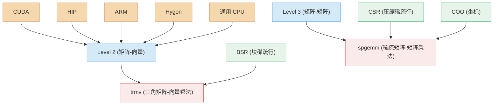

上图展示了库的核心组件。顶层是支持的硬件后端，每个后端都有针对 BLAS Level 2 和 Level 3 函数的优化实现。这些函数通常操作于特定的稀疏矩阵格式，例如 BSR 或 CSR。

*Sources: arm/kernel/level2/mv/trmv/trmv_bsr_u_hi_trans.hpp, cuda/kernel/level3/ac/MultiplyKernels.h, hygon/kernel/level2/mv/trmv/trmv_bsr_u_hi_trans.hpp, hip/kernel/level3/ac/MultiplyKernels.h*

## Level 2 函数: 稀疏矩阵-向量运算 (TRMV)

Level 2 函数处理矩阵-向量操作。在 AlphaSPARSE 中，一个典型的例子是 `trmv`（三角矩阵-向量乘法），它被广泛实现用于 BSR（Block Sparse Row）格式。

### BSR 格式与实现变体

`trmv` 的实现是围绕 BSR 格式构建的。代码通过迭代矩阵的块行来执行计算，并根据块的列索引是否与行索引相同来区分对角块和非对角块。

该库提供了多种 `trmv` 的变体，以支持不同的矩阵属性，如下表所示：

| 函数名 | 矩阵属性 | 描述 | 示例源文件 |
| --- | --- | --- | --- |
| `trmv_bsr_u_hi_trans` | Unit, Upper, Transpose | 对单位上三角矩阵的转置进行向量乘法。 | `hygon/kernel/level2/mv/trmv/trmv_bsr_u_hi_trans.hpp` |
| `trmv_bsr_u_hi_conj` | Unit, Upper, Conjugate | 对单位上三角矩阵的共轭进行向量乘法。 | `plain/kernel/level2/mv/trmv/trmv_bsr_u_hi_conj_plain.hpp` |
| `trmv_bsr_n_lo_trans` | Non-unit, Lower, Transpose | 对非单位下三角矩阵的转置进行向量乘法。 | `plain/kernel/level2/mv/trmv/trmv_bsr_n_lo_trans_plain.hpp` |
| `trmv_bsr_u_lo_trans` | Unit, Lower, Transpose | 对单位下三角矩阵的转置进行向量乘法。 | `plain/kernel/level2/mv/trmv/trmv_bsr_u_lo_trans_plain.hpp` |
| `trmv_bsr_n_hi_trans` | Non-unit, Upper, Transpose | 对非单位上三角矩阵的转置进行向量乘法。 | `plain/kernel/level2/mv/trmv/trmv_bsr_n_hi_trans_plain.hpp` |
| `trmv_bsr_u_lo` | Unit, Lower, Non-transpose | 对单位下三角矩阵进行向量乘法。 | `hygon/kernel/level2/mv/trmv/trmv_bsr_u_lo.hpp` |

### 存储布局

所有 `trmv` 实现都支持行主序（`ALPHA_SPARSE_LAYOUT_ROW_MAJOR`）和列主序（`ALPHA_SPARSE_LAYOUT_COLUMN_MAJOR`）两种块内元素存储布局。内核函数会根据 `A->block_layout` 标志选择不同的计算路径。

以下代码片段展示了这种布局检查：

```cpp
// file: arm/kernel/level2/mv/trmv/trmv_bsr_u_hi_trans.hpp:24-71if (A->block_layout == ALPHA_SPARSE_LAYOUT_ROW_MAJOR){    ALPHA_INT diag_block = 0;    for (ALPHA_INT i = 0; i < m_inner; i++){        // ... Row-major computation logic    }}else if (A->block_layout == ALPHA_SPARSE_LAYOUT_COLUMN_MAJOR){    ALPHA_INT diag_block = 0;    for (ALPHA_INT i = 0; i < m_inner; i++){        // ... Column-major computation logic    }}
```

*Sources: arm/kernel/level2/mv/trmv/trmv_bsr_u_hi_trans.hpp:24-117, hygon/kernel/level2/mv/trmv/trmv_bsr_u_hi_trans.hpp:24-117*

## Level 3 函数: 稀疏矩阵-矩阵乘法 (SpGEMM)

Level 3 函数处理矩阵-矩阵操作。AlphaSPARSE 为 CUDA 和 HIP 平台提供了 `ac-SpGEMM` 算法的高性能实现，用于通用的稀疏矩阵-矩阵乘法。

*Sources: cuda/kernel/level3/ac/MultiplyKernels.h:15-18, hip/kernel/level3/ac/MultiplyKernels.h:15-18*

### ac-SpGEMM 算法流程

`ac-SpGEMM` 实现分为多个阶段，每个阶段由一个或多个独立的内核函数执行。这种分阶段的方法允许对算法的每个部分进行精细的控制和优化。

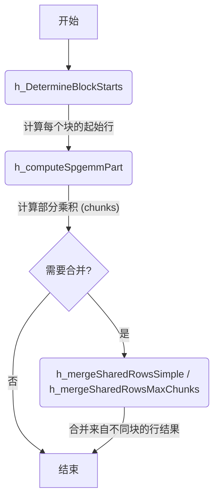

该流程图展示了 SpGEMM 的主要步骤：
1. **确定块起始点 (`h_DetermineBlockStarts`)**: 预处理步骤，用于为后续计算阶段划分工作负载。
2. **计算 SpGEMM 部分 (`h_computeSpgemmPart`)**: 核心计算内核，每个线程块计算输入矩阵 A 的一部分行与矩阵 B 的乘积，生成中间结果（称为 “chunks”）。
3. **合并行 (`h_mergeSharedRows*`)**: 如果一个输出行由多个线程块共同计算，则需要此步骤来合并这些块生成的中间结果。库提供了两种合并策略：`Simple` 和 `MaxChunks`。

*Sources: hip/kernel/level3/ac/MultiplyKernels.h:60-101, cuda/kernel/level3/ac/MultiplyKernels.h:60-101*

### 主要内核接口

`AcSpGEMMKernels` 类封装了 SpGEMM 的所有主机端启动函数。下表总结了这些关键函数。

| 函数 | 描述 |
| --- | --- |
| `h_DetermineBlockStarts` | 确定每个线程块处理的起始行ID。 |
| `h_computeSpgemmPart` | 执行稀疏矩阵乘法的主要计算阶段，生成中间块。 |
| `h_mergeSharedRowsSimple` | 一个简单的内核，用于合并由多个块计算的共享行的结果。 |
| `h_mergeSharedRowsMaxChunks` | 一个更复杂的内核，用于处理具有大量中间块的行的合并，采用重采样和路径查找等高级策略。 |

*Sources: hip/kernel/level3/ac/MultiplyKernels.h:60-101, cuda/kernel/level3/ac/MultiplyKernels.h:60-101, hip/kernel/level3/ac/acSpGEMM_MergeMaxChunks.h*

### `mergeSharedRowsMaxChunks` 内核详解

`mergeSharedRowsMaxChunks` 是一个高度优化的设备端内核，用于解决 SpGEMM 中的一个关键瓶颈：合并由大量中间块组成的行。为了高效地完成这项工作，该内核利用了 `hipcub` 库（或 CUDA 中的 `cub`）提供的并行原语。

- **并行排序**: 使用 `hipcub::BlockRadixSort` 对采样索引或块索引进行高效的并行排序。
- **并行扫描**: 使用 `hipcub::BlockScan` 在线程块内执行前缀和操作，用于计算路径或偏移量。

这些并行构建块是实现高性能合并操作的基础。

*Sources: hip/kernel/level3/ac/acSpGEMM_MergeMaxChunks.h:89-92*

## 测试与配置

该库包含一个全面的测试套件，用于验证内核的正确性并评估其性能。测试程序可以通过命令行参数进行灵活配置。

### 命令行参数

`args.h` 头文件定义了一系列函数，用于从命令行解析测试参数。这使得用户可以轻松地指定输入矩阵、操作类型、布局和算法参数。

| 参数 | 描述 | 解析函数示例 |
| --- | --- | --- |
| 数据文件 | 指定输入矩阵的文件路径。 | `args_get_data_fileA()` |
| 布局 | 矩阵块内元素的存储布局（行主序或列主序）。 | `alpha_args_get_layout()` |
| 操作 | 对矩阵执行的操作（如转置、共轭转置）。 | `alpha_args_get_transA()` |
| 矩阵描述符 | 定义矩阵的属性（如三角、对角类型等）。 | `alpha_args_get_matrix_descrA()` |
| 数据类型 | 矩阵元素的数据类型（如 float, double）。 | `alpha_args_get_data_type()` |
| 线程数 | （适用于 CPU）指定用于计算的线程数。 | `args_get_thread_num()` |
| 检查 | 是否执行正确性检查。 | `args_get_if_check()` |

*Sources: hip/test/include/args.h, hygon/test/include/args.h, arm/test/include/args.h, dcu/test/include/args.h*

### CUDA 测试构建

对于 CUDA 后端，`CMakeLists.txt` 文件定义了如何构建测试示例。通过一个辅助函数 `add_alphasparse_example` 来简化测试目标的创建过程。

```
# file: cuda/test/CMakeLists.txt:1-17function(add_alphasparse_example TEST_SOURCE)
  get_filename_component(TEST_TARGET ${TEST_SOURCE} NAME_WE)
  add_executable(${TEST_TARGET} ${TEST_SOURCE})
  target_compile_definitions(${TEST_TARGET} PUBLIC __CUDA_NO_HALF2_OPERATORS__)
  target_compile_definitions(${TEST_TARGET} PUBLIC CUDA_ARCH=${CUDA_ARCH})
  set_property(TARGET ${TEST_TARGET} PROPERTY CUDA_ARCHITECTURES ${CUDA_ARCH})
  # Include common client headers  target_include_directories(${TEST_TARGET} PRIVATE $<BUILD_INTERFACE:${PROJECT_SOURCE_DIR}/include>)
  # Linker dependencies  target_link_libraries(${TEST_TARGET} PUBLIC      CUDA::cudart      CUDA::cudart_static      CUDA::cusparse      CUDA::cusparse_static      alphasparse
    )
endfunction()
```

此函数负责：
- 创建可执行文件。
- 设置必要的编译定义，例如 `CUDA_ARCH`。
- 指定头文件包含目录。
- 链接核心库，包括 `cudart`、`cusparse` 和 `alphasparse` 本身。

*Sources: cuda/test/CMakeLists.txt:1-17*

---

## CPU 后端实现

### Related Pages

Related topics: [GPU 后端实现](about:blank#page-8), [多平台架构设计](about:blank#page-3)

- Relevant source files
    
    本维基页面的生成参考了以下文件：
    
    - [hip/kernel/level3/ac/csrspgemm_device_ac.h](hip/kernel/level3/ac/csrspgemm_device_ac.h)
    - [hip/kernel/level3/ac/acSpGEMM_SpGEMM.h](hip/kernel/level3/ac/acSpGEMM_SpGEMM.h)
    - [hip/kernel/level3/ac/acSpGEMM_MergeSimple.h](hip/kernel/level3/ac/acSpGEMM_MergeSimple.h)
    - [hip/kernel/level3/ac/acSpGEMM_MergeMaxChunks.h](hip/kernel/level3/ac/acSpGEMM_MergeMaxChunks.h)
    - [hip/kernel/level3/ac/acSpGEMM_MergeGeneralized.h](hip/kernel/level3/ac/acSpGEMM_MergeGeneralized.h)
    - [hip/kernel/level3/ac/MultiplyKernels.h](hip/kernel/level3/ac/MultiplyKernels.h)
    - [hip/kernel/level3/ac/HelperFunctions.h](hip/kernel/level3/ac/HelperFunctions.h)
    - [cuda/kernel/level3/csrspgemm_device_ac.h](cuda/kernel/level3/csrspgemm_device_ac.h)

# ac-SpGEMM GPU 内核实现

ac-SpGEMM (Adaptive Compute Sparse General Matrix-Matrix Multiplication) 是一种在 GPU 上实现的高性能稀疏矩阵乘法算法。其核心思想是采用“自适应”策略，将复杂的计算过程分解为两个主要阶段：**计算阶段**和**合并阶段**。计算阶段负责生成中间结果（称为“分块”或 Chunks），而合并阶段则根据每个输出行的中间结果特性，动态选择最优的合并内核来完成最终计算。

这种两阶段自适应方法旨在应对稀疏矩阵乘法中不规则的计算和内存访问模式，通过为不同复杂度的行应用不同的处理策略（简单、最大分块、通用），从而最大化 GPU 的并行计算效率。

Sources: hip/kernel/level3/csrspgemm_device_ac.h:185-190, hip/kernel/level3/ac/MultiplyKernels.h

## 整体架构与执行流程

ac-SpGEMM 的执行流程由主机端代码（Host-side Orchestrator）统一调度，该调度器负责管理内存、启动内核以及处理内核执行期间可能出现的资源不足等问题。整个流程可以概括为计算和合并两个阶段，并且会根据需要循环执行，直到所有计算完成。

Sources: hip/kernel/level3/csrspgemm_device_ac.h:159-172

### 执行流程图

下面的流程图展示了从主机端发起 SpGEMM 计算的完整生命周期。

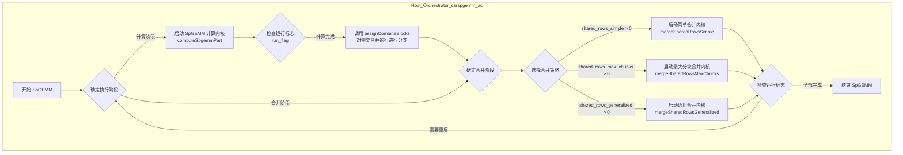

- **阶段 0 (计算)**：主机启动 `computeSpgemmPart` 内核，此内核对矩阵 A 的行与矩阵 B 进行乘法运算，并将中间结果存储为分块。
- **行分类**：计算阶段完成后，主机调用 `assignCombineBlocks` 函数。该函数分析每个输出行的中间分块数量和大小，将其分为三种类型：简单合并、最大分块合并和通用合并。
- **阶段 1 (合并)**：主机根据分类结果，为每种类型的行启动相应的合并内核。
- **循环与重启**：整个过程可能因为分块内存不足而需要多次迭代。`run_flag` 用于协调主机和设备，以确保所有数据都得到处理。

Sources: hip/kernel/level3/csrspgemm_device_ac.h:174-297, hip/kernel/level3/ac/HelperFunctions.h:237-240

### Host-Device 交互时序图

此图详细描述了主机端 `csrspgemm_ac` 函数与各个 GPU 内核之间的交互顺序。

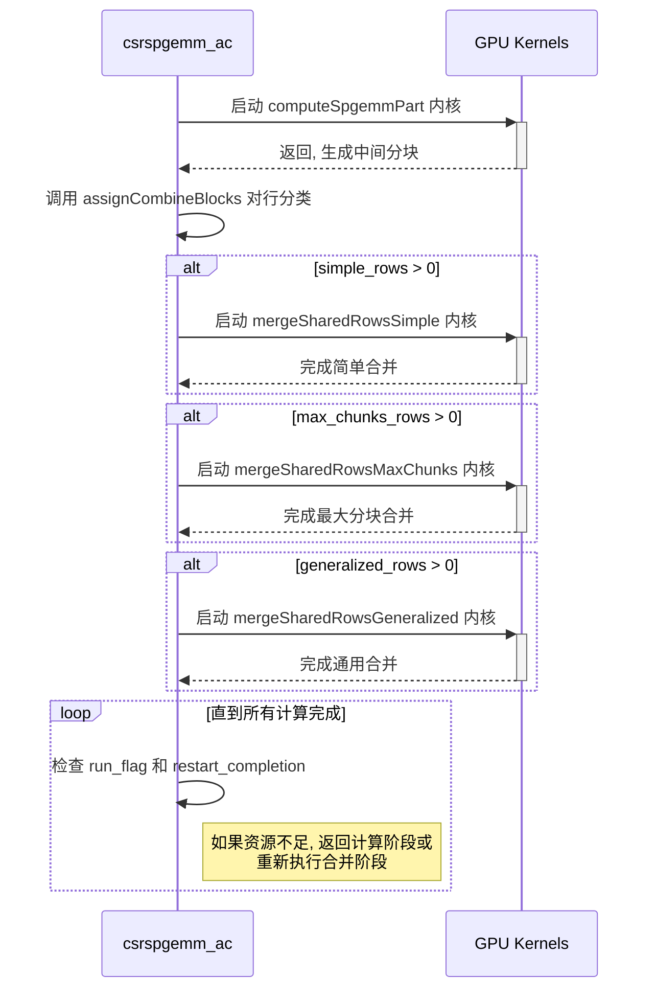

Sources: hip/kernel/level3/csrspgemm_device_ac.h:174-297

## 核心内核详解

ac-SpGEMM 的核心是其针对不同计算负载设计的多个 GPU 内核。

### 阶段一：计算内核 (`computeSpgemmPart`)

这是 SpGEMM 的第一个内核，负责执行实际的矩阵乘法并生成未合并的中间结果。

- **功能**：为分配给它的矩阵 A 的每一行，计算其与矩阵 B 的乘积。结果以 (列索引, 值) 对的形式存储在称为“分块 (Chunk)”的临时缓冲区中。
- **索引压缩**：为了优化性能和内存使用，该内核根据输入矩阵的维度选择不同的索引打包策略 (`SORT_TYPE_MODE`)。
    - `SORT_TYPE_MODE = 0`：当行和列索引都可以用 16 位表示时使用。
    - `SORT_TYPE_MODE = 1`：当列索引范围较大时，对每个线程块内的行号进行重映射，以腾出更多位给列索引。
    - `SORT_TYPE_MODE = 2`：不进行特殊压缩，使用完整的 32 位索引。
- **输出**：生成多个分块，并记录哪些行产生了多个分块（即需要合并），这些信息通过 `sharedRowTracker` 传递给主机。

Sources: hip/kernel/level3/ac/acSpGEMM_SpGEMM.h:35-42, hip/kernel/level3/csrspgemm_device_ac.h:191-240

### 阶段二：合并内核

合并阶段根据 `assignCombineBlocks` 的分类结果，调用三种不同的内核之一。

### 简单合并 (`mergeSharedRowsSimple`)

- **适用场景**：当一个输出行的所有中间分块的总大小可以完全装入 GPU 的共享内存 (shared memory) 时，使用此内核。
- **工作原理**：
    1. 将一个输出行的所有分块数据从全局内存加载到共享内存。
    2. 在共享内存中，所有线程协同进行排序和合并（累加具有相同列索引的值）。
    3. 将最终合并和排序后的结果直接写回全局内存中的输出矩阵位置。
- **优势**：由于完全在高速的共享内存中操作，避免了昂贵的全局内存原子操作，效率极高。

Sources: hip/kernel/level3/ac/acSpGEMM_MergeSimple.h:32-40, hip/kernel/level3/csrspgemm_device_ac.h:257-285

### 最大分块合并 (`mergeSharedRowsMaxChunks`)

- **适用场景**：当一个输出行的分块数量超过 2 个但小于等于一个预设阈值 `MERGE_MAX_CHUNKS` 时，使用此内核。这种情况下的数据量超出了共享内存的容量。
- **工作原理**：该内核采用一种复杂的迭代式路径查找算法来分批处理数据。
    1. **采样 (Sampling)**：从每个分块中抽取一部分列索引作为样本，以评估数据的分布。
    2. **排序 (Sorting)**：对所有样本进行全局排序。
    3. **路径查找 (Path Finding)**：基于排序后的样本，计算出一个“路径”。该路径定义了本次迭代中从每个分块应该读取多少个元素，以确保合并的中间结果数量在一个可控范围内 (`ELEMENTS_PER_THREAD*THREADS`)。
    4. **合并与输出**：根据计算出的路径，从各个分块中取出数据，在寄存器和共享内存中进行合并，然后将这批处理完的结果写入一个新的输出分块。
    5. **迭代**：更新每个分块的指针，指向未处理的数据，然后重复以上步骤，直到该行的所有数据都被处理完毕。

```cpp
// hip/kernel/level3/ac/acSpGEMM_MergeMaxChunks.h:195while (true){    // ...    // 1. Sampling from each chunk    // ...    // 2. Sort samples using hipcub::BlockRadixSort    SampleSorter(smem.sorterTempMem).Sort(mySampledIds, mySamplePayload);    // 3. Merge paths and compute output count for each path    PathMergeScan(smem.pathmergeTempMem).InclusiveScan(paths, paths, PathMergerOp<MERGE_MAX_CHUNKS, PathEncodingBits>());    // ... find the best path (smem.usePath)    // 4. Load data according to the path, sort, and combine    // ...    // 5. Write out the merged data    // ...    // 6. Update pointers and element counts for the next iteration    // ...    if (smem.completed)        break;}
```

Sources: hip/kernel/level3/ac/acSpGEMM_MergeMaxChunks.h:80-89, 195-430, hip/kernel/level3/csrspgemm_device_ac.h:290-297

### 通用合并 (`mergeSharedRowsGeneralized`)

- **适用场景**：当一个输出行的分块数量超过 `MERGE_MAX_CHUNKS` 时，这是最复杂的情况。
- **工作原理**：其核心思想与 `mergeSharedRowsMaxChunks` 类似，都采用迭代和采样的策略。但它为处理极大数量的分块设计了更通用的路径查找和数据管理机制，以确保算法的可扩展性和稳定性。

Sources: hip/kernel/level3/ac/acSpGEMM_MergeGeneralized.h:473-481, hip/kernel/level3/csrspgemm_device_ac.h:302-309

## 关键概念

### 重启机制 (Restart Mechanism)

在计算或合并过程中，可能会出现用于存储新生成分块的全局内存耗尽的情况。为了处理这种情况，ac-SpGEMM 设计了一套重启机制。

- 当内核检测到内存不足时，它会停止当前工作，并通过一个全局的 `run_flag` 和 `restart_completion` 数组向主机报告状态。
- 主机在检测到重启请求后，会分配更多内存，并根据内核返回的状态信息，重新启动之前中断的计算或合并任务。

下表列出了在 `MultiplyKernels.h` 中定义的重启状态码及其含义。

| 状态码 | 值 | 描述 |
| --- | --- | --- |
| `RESTART_OFF` | 0 | 无需重启，正常完成。 |
| `RESTART_WRONG_CASE` | 1 | 在 `MaxChunks` 合并中发现情况比预想的更简单，应切换到其他合并策略。 |
| `RESTART_FIRST_ITERATION` | 2 | 首次迭代，尚未完成任何工作。 |
| `RESTART_ITERATION_FINISH` | 3 | `MaxChunks` 合并中的一次迭代完成，但整行尚未完成。 |
| `RESTART_ITERATION_UNKNOWN` | 4 | 迭代状态未知，通常在一次迭代后设置，表示需要继续处理。 |

Sources: hip/kernel/level3/ac/MultiplyKernels.h:18-22, hip/kernel/level3/ac/acSpGEMM_MergeMaxChunks.h:170-174, hip/kernel/level3/ac/acSpGEMM_MergeGeneralized.h:364-377

---

## GPU 后端实现

### Related Pages

Related topics: [CPU 后端实现](about:blank#page-7), [多平台架构设计](about:blank#page-3)

- Relevant source files
    
    为生成此维基页面，使用了以下文件作为上下文：
    
    - [cuda/kernel/level3/ac/MultiplyKernels.h](cuda/kernel/level3/ac/MultiplyKernels.h)
    - [hip/kernel/level3/ac/MultiplyKernels.h](hip/kernel/level3/ac/MultiplyKernels.h)
    - [cuda/kernel/level3/csrspgemm_device_ac.h](cuda/kernel/level3/csrspgemm_device_ac.h)
    - [hip/kernel/level3/csrspgemm_device_ac.h](hip/kernel/level3/csrspgemm_device_ac.h)
    - [hip/kernel/level3/ac/acSpGEMM_SpGEMM.h](hip/kernel/level3/ac/acSpGEMM_SpGEMM.h)
    - [hip/kernel/level3/ac/acSpGEMM_MergeSimple.h](hip/kernel/level3/ac/acSpGEMM_MergeSimple.h)
    - [hip/kernel/level3/ac/acSpGEMM_MergeMaxChunks.h](hip/kernel/level3/ac/acSpGEMM_MergeMaxChunks.h)
    - [hip/kernel/level3/ac/acSpGEMM_MergeGeneralized.h](hip/kernel/level3/ac/acSpGEMM_MergeGeneralized.h)
    - [hip/kernel/level3/ac/acSpGEMM_ChunksToCSR.h](hip/kernel/level3/ac/acSpGEMM_ChunksToCSR.h)
    - [cuda/test/CMakeLists.txt](cuda/test/CMakeLists.txt)

# GPU 后端实现

本文档详细介绍了 alphasparse 库中用于稀疏矩阵运算的 GPU 后端实现，重点是基于 CUDA 和 HIP 的 `ac-SpGEMM` (adaptive-computation SpGEMM) 算法。该后端旨在为稀疏矩阵-矩阵乘法（SpGEMM）提供高性能计算能力。实现是平台无关的，同时支持 NVIDIA (CUDA) 和 AMD (HIP) 的 GPU 架构。

该实现的核心是一个多阶段、可重启的算法，它将复杂的 SpGEMM 操作分解为计算、合并和数据转换等多个内核。这种设计允许处理超过 GPU 内存容量的大型矩阵，并通过自适应选择合并策略来优化性能。

## 核心架构：AcSpGEMMKernels 类

`AcSpGEMMKernels` 类是 GPU 内核启动的中心接口。它封装了 ac-SpGEMM 算法所有阶段的启动逻辑，并管理 CUDA/HIP 流和启动维度（gridDim, blockDim）。该类提供了多个模板化的主机端函数（`h_*` 前缀），用于调用相应的设备端 `__global__` 内核。

Sources: cuda/kernel/level3/ac/MultiplyKernels.h:42-45, hip/kernel/level3/ac/MultiplyKernels.h:42-45

```cpp
class AcSpGEMMKernels
{public:    AcSpGEMMKernels(uint32_t blockDim=128):    blockDim{blockDim}    {}    void setLaunchDimensions(uint32_t _gridDim, cudaStream_t _stream = 0, uint32_t _blockDim = 128)    {        gridDim = _gridDim;        blockDim = _blockDim;        stream = _stream;    }    // ... kernel launch methods};
```

Sources: cuda/kernel/level3/ac/MultiplyKernels.h:40-52

下面的类图展示了 `AcSpGEMMKernels` 类的主要方法，这些方法对应于 ac-SpGEMM 算法的不同阶段。

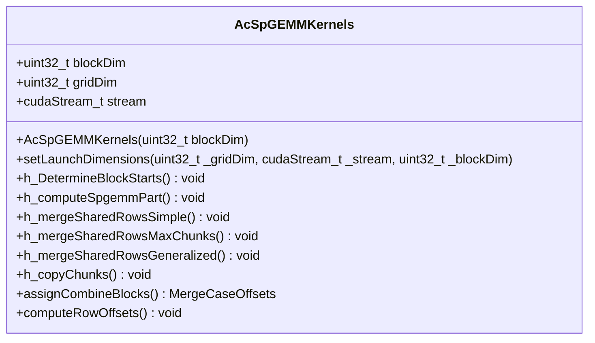

Sources: hip/kernel/level3/ac/MultiplyKernels.h:40-128

## ac-SpGEMM 算法流程

ac-SpGEMM 算法是一个迭代过程，由 `csrspgemm_ac_impl` 函数驱动。该函数在一个 `while` 循环中执行，直到所有计算完成。每一轮迭代可能执行 SpGEMM 计算阶段或行合并阶段，具体取决于 `rowmerging` 标志。这种设计允许算法在内存不足时暂停，重新分配缓冲区，然后从中断处继续执行。

Sources: hip/kernel/level3/csrspgemm_device_ac.h:218-228

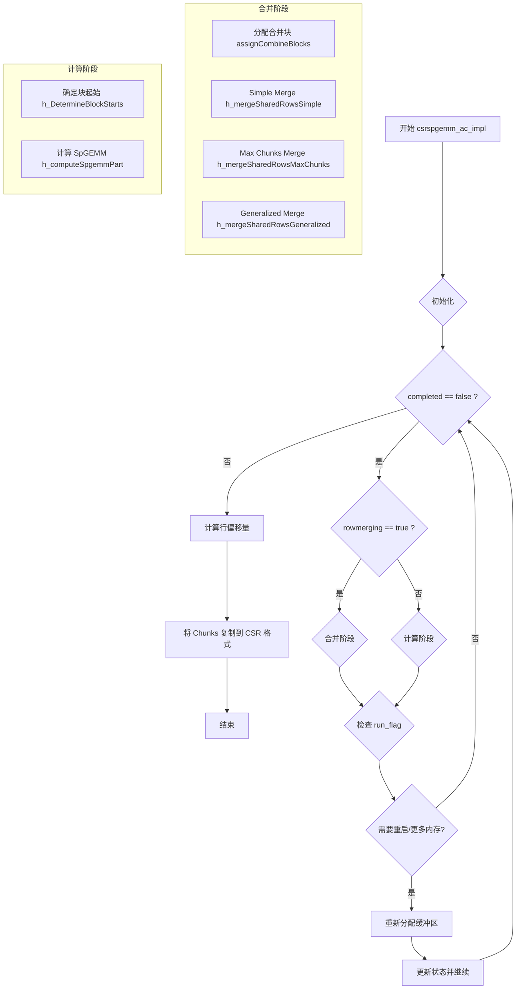

该图表展示了在 `csrspgemm_device_ac.h` 中实现的 ac-SpGEMM 算法的宏观控制流程。
Sources: cuda/kernel/level3/csrspgemm_device_ac.h:218-450

### 阶段 1: SpGEMM 计算 (h_computeSpgemmPart)

这是算法的核心计算阶段。`h_computeSpgemmPart` 内核负责计算矩阵乘法的部分结果。这些中间结果被组织成称为 “Chunks” 的数据块，并存储在临时缓冲区中。对于需要合并多个中间结果的行（共享行），会记录下来以便在后续的合并阶段进行处理。

此内核根据输入矩阵的维度（特别是 B 矩阵的列数 `Bcols`）采用不同的 `SORT_TYPE_MODE` 模板参数进行优化。

| 模式 (SORT_TYPE_MODE) | 条件 | 描述 |
| --- | --- | --- |
| `0` | `Arows < 0x10000 && Bcols < 0x10000` | 行和列索引都可以用16位表示，从而将它们打包成一个32位整数进行排序。 |
| `1` | `Bcols < (1 << LZCNT(nnz_per_thread*threads)) - 1` | B的列数较少。内核将每个局部行重新映射以减少位数，并将剩余的位用于列索引。 |
| `2` | 其他情况 | 通用情况，不进行特殊的索引压缩。 |

Sources: cuda/kernel/level3/csrspgemm_device_ac.h:250-305, hip/kernel/level3/ac/acSpGEMM_SpGEMM.h:10-21

### 阶段 2: 合并共享行 (Merge Stage)

当一个输出行由多个块计算出的多个 Chunks 组成时，就需要进入合并阶段。系统会根据共享行的数量和每个行产生的 Chunks 数量，自适应地选择三种不同的合并策略之一。

`assignCombineBlocks` 函数负责分析共享行并将其分配给适当的合并内核。

Sources: hip/kernel/level3/ac/MultiplyKernels.h:115-117, cuda/kernel/level3/csrspgemm_device_ac.h:312-316

### 简单合并 (h_mergeSharedRowsSimple)

适用于所有中间结果（Chunks）可以完全加载到 GPU 的共享内存中的情况。这是一个高效的单遍合并内核。该内核存在两种变体（由 `LONG_SORT` 模板参数控制），以应对不同的列数范围。

Sources: hip/kernel/level3/ac/acSpGEMM_MergeSimple.h:130-142, cuda/kernel/level3/csrspgemm_device_ac.h:326-360

### 最大块合并 (h_mergeSharedRowsMaxChunks)

当 Chunks 数量超过简单合并的限制，但仍在一个可管理的范围内（小于 `MERGE_MAX_CHUNKS`）时，使用此策略。该内核通过多路径采样和合并来迭代处理数据，直到所有 Chunks 都被合并。如果单次迭代无法完成，它会将剩余工作保存到全局内存中以供下次重启。

Sources: hip/kernel/level3/ac/acSpGEMM_MergeMaxChunks.h:74-83, cuda/kernel/level3/csrspgemm_device_ac.h:363-376

### 通用合并 (h_mergeSharedRowsGeneralized)

这是最通用的合并策略，用于处理具有大量 Chunks 的行。它采用更复杂的基于采样的多遍算法来逐步合并数据，确保即使在极端情况下也能正确完成计算。

Sources: hip/kernel/level3/ac/acSpGEMM_MergeGeneralized.h:126-138, cuda/kernel/level3/csrspgemm_device_ac.h:379-391

### 阶段 3: 结果转换 (h_copyChunks)

在所有计算和合并阶段完成后，最终的 Chunks 存储在全局内存中。`h_copyChunks` 内核负责将这些分散的 Chunk 数据块收集起来，并按照标准的 CSR (Compressed Sparse Row) 格式写入到最终的输出矩阵中。此内核会考虑 Chunks 的元数据，如起始偏移和消耗的元素，以确保数据的正确复制。

Sources: hip/kernel/level3/ac/acSpGEMM_ChunksToCSR.h:21-72

## 重启机制

为了处理大型问题，该算法实现了一个复杂的重启机制。在计算或合并的任何阶段，如果出现资源不足（例如，临时缓冲区耗尽），内核会设置一个运行标志 `run_flag`，并将当前进度保存到全局内存中。主控制循环 (`csrspgemm_ac_impl`) 会捕获此标志，重新分配更大的缓冲区，然后从保存的状态重新启动内核，从而继续计算。

`restart_completion` 数组用于存储每个块的重启状态。以下是一些定义的重启常量：

| 常量 | 值 | 描述 |
| --- | --- | --- |
| `RESTART_OFF` | 0 | 无需重启，操作正常完成。 |
| `RESTART_WRONG_CASE` | 1 | 分配的合并策略不正确，需要重新分配。 |
| `RESTART_FIRST_ITERATION` | 2 | 迭代的第一次运行。 |
| `RESTART_ITERATION_FINISH` | 3 | 迭代完成。 |
| `RESTART_ITERATION_UNKNOWN` | 4 | 迭代未完成，需要继续。 |

Sources: cuda/kernel/level3/ac/MultiplyKernels.h:22-26, hip/kernel/level3/ac/acSpGEMM_MergeMaxChunks.h:237-241

下面的序列图说明了主机和设备之间在发生资源不足时的交互过程。

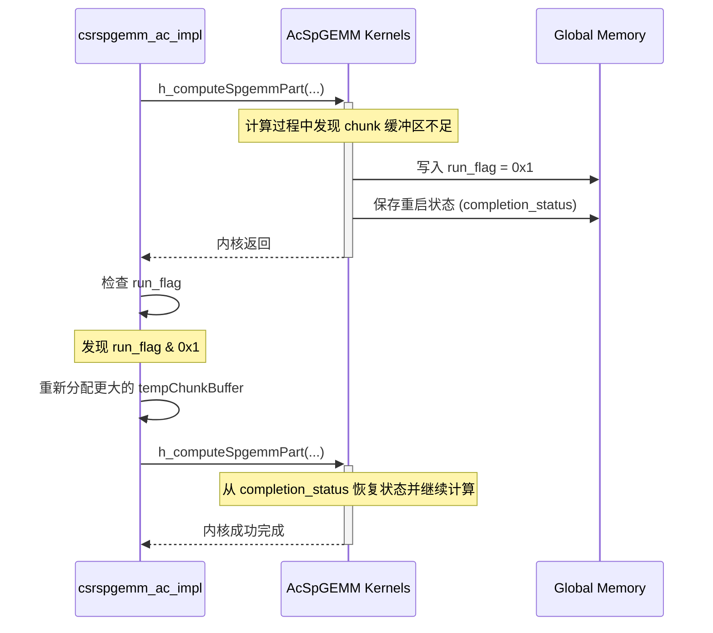

Sources: hip/kernel/level3/csrspgemm_device_ac.h:218-450

## 构建与编译

项目使用 CMake 来管理构建过程。对于 GPU 后端的测试用例，`add_alphasparse_example` 函数被用来定义可执行文件。该函数会自动设置目标属性，包括：

- **CUDA 架构**: 通过 `CUDA_ARCH` 变量设置，并传递给 `set_property(TARGET ... PROPERTY CUDA_ARCHITECTURES ...)`。
- **包含目录**: 包含项目头文件。
- **链接库**: 链接到 `alphasparse` 库本身以及 CUDA/HIP 运行时库（如 `CUDA::cudart` 和 `CUDA::cusparse`）。

```
function(add_alphasparse_example TEST_SOURCE)
  get_filename_component(TEST_TARGET ${TEST_SOURCE} NAME_WE)
  add_executable(${TEST_TARGET} ${TEST_SOURCE})
  target_compile_definitions(${TEST_TARGET} PUBLIC CUDA_ARCH=${CUDA_ARCH})
  set_property(TARGET ${TEST_TARGET} PROPERTY CUDA_ARCHITECTURES ${CUDA_ARCH})
  # ...  target_link_libraries(${TEST_TARGET} PUBLIC      CUDA::cudart      CUDA::cusparse      alphasparse
    )
endfunction()
```

Sources: cuda/test/CMakeLists.txt:1-15

## 总结

alphasparse 的 GPU 后端为 SpGEMM 提供了一个健壮且高性能的实现。其核心是 `ac-SpGEMM` 算法，通过多阶段计算、自适应合并策略和强大的重启机制，能够高效处理各种规模和稀疏模式的矩阵。`AcSpGEMMKernels` 类作为统一的接口，简化了复杂的内核调用逻辑，而 CUDA 和 HIP 的双重支持确保了其在主流 GPU 平台上的可移植性。

---

## 构建系统

### Related Pages

Related topics: [快速入门](about:blank#page-2), [测试框架](about:blank#page-10)

- Relevant source files
    
    The following files were used as context for generating this wiki page:
    
    - [cuda/test/CMakeLists.txt](cuda/test/CMakeLists.txt)
    - [arm/test/CMakeLists.txt](arm/test/CMakeLists.txt)
    - [hip/test/CMakeLists.txt](hip/test/CMakeLists.txt)
    - [hip/kernel/level3/ac/acSpGEMM_MergeMaxChunks.h](hip/kernel/level3/ac/acSpGEMM_MergeMaxChunks.h)
    - [hip/kernel/level3/ac/MultiplyKernels.h](hip/kernel/level3/ac/MultiplyKernels.h)
    - [hip/kernel/level3/ac/HelperFunctions.h](hip/kernel/level3/ac/HelperFunctions.h)
    - [hip/kernel/level3/ac/acSpGEMM_MergeGeneralized.h](hip/kernel/level3/ac/acSpGEMM_MergeGeneralized.h)
    - [cuda/kernel/level3/ac/MultiplyKernels.h](cuda/kernel/level3/ac/MultiplyKernels.h)
    - [hip/kernel/level3/csrspgemm_device_fast.h](hip/kernel/level3/csrspgemm_device_fast.h)
    - [cuda/kernel/level3/csrspgemm_device_fast.h](cuda/kernel/level3/csrspgemm_device_fast.h)
    - [include/alphasparse/kernel_dcu/kernel_csr_c_dcu.h](include/alphasparse/kernel_dcu/kernel_csr_c_dcu.h)
    - [include/alphasparse/kernel_plain/kernel_dia_c.h](include/alphasparse/kernel_plain/kernel_dia_c.h)
    - [include/alphasparse/kernel_plain/kernel_csr_c.h](include/alphasparse/kernel_plain/kernel_csr_c.h)
    - [include/alphasparse/kernel_dcu/kernel_bsr_c_dcu.h](include/alphasparse/kernel_dcu/kernel_bsr_c_dcu.h)
    - [include/alphasparse/kernel_plain/kernel_dia_z.h](include/alphasparse/kernel_plain/kernel_dia_z.h)

# 构建系统

## 简介

本项目的构建系统利用 CMake 来管理和自动化编译过程，特别关注为不同硬件后端（包括 CUDA、HIP 和 ARM）构建测试可执行文件。系统设计的核心是一个可重用的 CMake 函数 `add_alphasparse_example`，该函数根据目标平台和架构进行调整，以简化新测试用例的添加。该系统处理依赖链接、编译器定义和特定于架构的编译选项，确保在各种环境中具有一致性和可移植性。

## 核心构建逻辑：`add_alphasparse_example` 函数

构建系统的基石是 `add_alphasparse_example` 函数。该函数在每个后端（CUDA, HIP, ARM）的测试目录中都有定义，并根据平台的特定需求进行了定制。其主要职责是接收一个源文件作为输入，并配置一个可执行的测试目标。

该函数的基本工作流程如下：

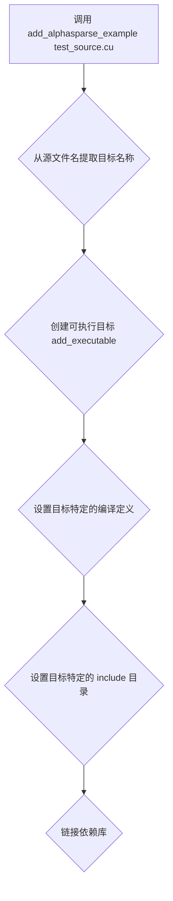

这是一个高级概述。每个平台的具体实现细节在以下各节中详述。

Sources: cuda/test/CMakeLists.txt:1-19, hip/test/CMakeLists.txt:17-31, arm/test/CMakeLists.txt:1-15

## 特定后端的构建配置

系统为每个支持的硬件后端提供了专门的构建配置。

### CUDA 测试构建

CUDA 后端的测试构建配置位于 `cuda/test/CMakeLists.txt` 中。它使用 `add_alphasparse_example` 函数来定义和配置每个 CUDA 测试。

Sources: cuda/test/CMakeLists.txt

### 函数定义与工作流程

`add_alphasparse_example` 函数为 CUDA 目标执行以下步骤：

1. **目标创建**: 从源文件名（如 `generic/axpby_r_f32_test.cu`）中提取基本名称（`axpby_r_f32_test`）作为可执行文件的目标名称。
2. **编译器定义**: 添加两个公共编译定义：
    - `__CUDA_NO_HALF2_OPERATORS__`：禁用 `half2` 运算符。
    - `CUDA_ARCH=${CUDA_ARCH}`：将 CUDA 架构传递给编译器。
3. **CUDA 架构**: 使用 `set_property` 明确设置目标的 `CUDA_ARCHITECTURES` 属性。
4. **包含目录**: 将项目顶层的 `include` 目录添加到目标的包含路径中。
5. **库链接**: 将目标与一组核心库链接起来。

下面的图表演示了为 CUDA 测试目标设置链接依赖项的过程。

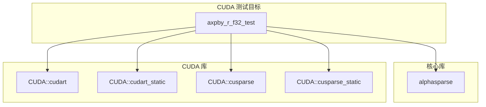

Sources: cuda/test/CMakeLists.txt:1-19

### 依赖项

每个 CUDA 测试目标都链接到以下库：

| 库 | 描述 |
| --- | --- |
| `CUDA::cudart` | CUDA 运行时库（动态） |
| `CUDA::cudart_static` | CUDA 运行时库（静态） |
| `CUDA::cusparse` | cuSPARSE 库（动态） |
| `CUDA::cusparse_static` | cuSPARSE 库（静态） |
| `alphasparse` | 项目的核心 AlphaSPARSE 库 |

Sources: cuda/test/CMakeLists.txt:12-17

### 条件编译

构建脚本包含一个条件块，用于仅在 CUDA 架构版本大于或等于 80 时编译支持 `bfloat16` 的测试。这确保了具有必要硬件支持的现代 GPU 才能构建这些特定的测试。

```
if (${CUDA_ARCH} GREATER_EQUAL 80)
#   add_alphasparse_example(generic/axpby_r_bf16_test.cu)#   add_alphasparse_example(level2/spmv_coo_r_bf16_test.cu)#   ...endif()
```

Sources: cuda/test/CMakeLists.txt:20-37

### HIP 测试构建

HIP 后端的测试构建配置在 `hip/test/CMakeLists.txt` 中定义，其结构与 CUDA 版本类似，但具有针对 ROCm/HIP 生态系统的特定依赖项和编译器定义。

Sources: hip/test/CMakeLists.txt

### 函数定义与工作流程

HIP 版本的 `add_alphasparse_example` 函数包括以下步骤：

1. **目标创建**: 与 CUDA 版本相同，从源文件名创建目标名称。
2. **编译器定义**:
    - `__HIP_PLATFORM_HCC__`：表示正在使用 HIP HCC 平台。
    - `CUDA_ARCH=${CUDA_ARCH}`：设置目标架构（尽管命名为 `CUDA_ARCH`，但在 HIP 上下文中用于 AMD GPU 架构）。
3. **包含目录**: 添加项目顶层 `include` 目录和当前 `hip/test/include` 目录。
4. **库链接**: 链接特定于 HIP 的库以及核心的 `alphasparse` 库。
5. **工具对象**: 链接一个名为 `alphasparse_hip_test_utils_objs` 的对象库，该库包含 HIP 测试中共享的通用代码（如 `args.hip`, `io.hip`）。

```mermaid
graph TD
    A[add_alphasparse_example&#40;test.hip&#41;] --> B{创建可执行目标};
    B --> C{定义 __HIP_PLATFORM_HCC__};
    B --> D{设置 include 目录};
    B --> E{链接库};
    E --> F[roc::hipsparse];
    E --> G[hip::host];
    E --> H[hip::device];
    E --> I[alphasparse];
    E --> J[alphasparse_hip_test_utils_objs];

```

Sources: hip/test/CMakeLists.txt:17-31

### 依赖项

每个 HIP 测试目标都链接到以下库：

| 库 | 描述 |
| --- | --- |
| `roc::hipsparse` | ROCm hipSPARSE 库 |
| `hip::host` | HIP 主机运行时 |
| `hip::device` | HIP 设备运行时 |
| `roc::rocprim` | ROCm rocPRIM 库 |
| `roc::rccl` | ROCm 通信库 |
| `alphasparse` | 项目的核心 AlphaSPARSE 库 |
| `$<TARGET_OBJECTS:alphasparse_hip_test_utils_objs>` | 包含通用测试实用程序代码的对象库 |

Sources: hip/test/CMakeLists.txt:25-30

### ARM 测试构建

ARM 的构建配置在 `arm/test/CMakeLists.txt` 中定义。此配置比 GPU 后端更简单，反映了其不同的目标平台。

Sources: arm/test/CMakeLists.txt

### 函数定义与工作流程

ARM 版本的 `add_alphasparse_example` 函数执行以下操作：

1. **目标创建**: 从源文件名创建目标名称。
2. **包含目录**: 添加项目顶层 `include` 目录。
3. **库链接**: 链接 `alphasparse` 库以及标准的系统库 `m` (数学库) 和 `dl` (动态链接库)。

Sources: arm/test/CMakeLists.txt:1-15

### 依赖项

| 库 | 描述 |
| --- | --- |
| `alphasparse` | 项目的核心 AlphaSPARSE 库 |
| `m` | 标准数学库 |
| `dl` | 动态链接加载器库 |

Sources: arm/test/CMakeLists.txt:10-14

### 测试目标

为 ARM 平台定义了以下测试，主要集中在 Level-2 和 Level-3 的 Hygon 特定测试上：
- `level2/mv_hygon_test.cpp`
- `level2/sv_hygon_test.cpp`
- `level3/mm_hygon_test.cpp`
- `level3/spmm_hygon_test.cpp`
- `level3/trsm_hygon_test.cpp`

Sources: arm/test/CMakeLists.txt:17-35

## 总结

该项目的 CMake 构建系统设计精良，通过模块化和可重用的函数，有效地支持了多个硬件后端。它通过为 CUDA、HIP 和 ARM 提供量身定制的构建路径，清晰地分离了不同平台的关注点。使用条件编译来处理特定于架构的功能，并集中管理依赖项，从而实现了一个强大而可维护的构建环境，便于扩展和管理复杂的测试套件。

---

## 测试框架

### Related Pages

Related topics: [构建系统](about:blank#page-9), [如何贡献](about:blank#page-11)

- Relevant source files
    
    The following files were used as context for generating this wiki page:
    
    - [cuda/test/CMakeLists.txt](cuda/test/CMakeLists.txt)
    - [arm/test/CMakeLists.txt](arm/test/CMakeLists.txt)
    - [hip/kernel/level3/ac/acSpGEMM_MergeMaxChunks.h](hip/kernel/level3/ac/acSpGEMM_MergeMaxChunks.h)
    - [hip/kernel/level3/ac/acSpGEMM_MergeSimple.h](hip/kernel/level3/ac/acSpGEMM_MergeSimple.h)
    - [hip/kernel/level3/ac/acSpGEMM_MergeGeneralized.h](hip/kernel/level3/ac/acSpGEMM_MergeGeneralized.h)
    - [cuda/kernel/level3/ac/MultiplyKernels.h](cuda/kernel/level3/ac/MultiplyKernels.h)
    - [hip/kernel/level3/ac/MultiplyKernels.h](hip/kernel/level3/ac/MultiplyKernels.h)
    - [include/alphasparse/kernel_plain/kernel_csr_c.h](include/alphasparse/kernel_plain/kernel_csr_c.h)

# 测试框架

该项目的测试框架利用 CMake 自动化构建和管理针对不同目标硬件平台的测试用例。该框架被明确地划分为针对 CUDA (GPU) 和 ARM (CPU) 平台的独立配置，确保了代码在不同环境下的正确性和性能。通过标准化的 CMake 函数，开发者可以轻松地为新的内核或功能添加测试。

## 核心构建逻辑

测试框架的核心是定义在 `CMakeLists.txt` 文件中的 `add_alphasparse_example` 函数。这个函数封装了为单个测试源文件创建可执行文件的所有必要步骤，包括编译定义、设置目标架构、包含头文件目录和链接依赖库。这种方法统一了所有测试用例的构建过程。

下面是两个平台测试构建流程的通用示意图。

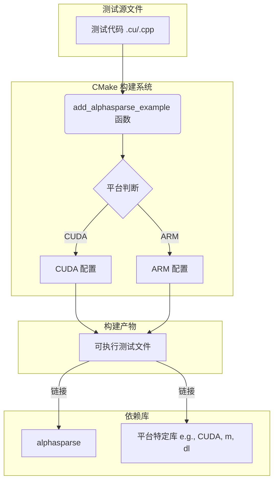

该图展示了测试源文件如何通过平台特定的 `add_alphasparse_example` 函数被处理，最终生成链接了核心库和平台库的可执行文件。

Sources: cuda/test/CMakeLists.txt, arm/test/CMakeLists.txt

## CUDA 测试框架

CUDA 测试框架专为基于 NVIDIA GPU 的内核验证而设计。它利用 CUDA 工具链来编译和链接测试。

Sources: cuda/test/CMakeLists.txt

### 测试定义与配置

通过 `add_alphasparse_example` CMake 函数来定义每个测试。该函数负责处理从源文件到最终可执行文件的所有构建步骤。

**`add_alphasparse_example` 函数实现:**

```
function(add_alphasparse_example TEST_SOURCE)
  get_filename_component(TEST_TARGET ${TEST_SOURCE} NAME_WE)
  add_executable(${TEST_TARGET} ${TEST_SOURCE})
  target_compile_definitions(${TEST_TARGET} PUBLIC __CUDA_NO_HALF2_OPERATORS__)
  target_compile_definitions(${TEST_TARGET} PUBLIC CUDA_ARCH=${CUDA_ARCH})
  set_property(TARGET ${TEST_TARGET} PROPERTY CUDA_ARCHITECTURES ${CUDA_ARCH})
  # Target compile options#   target_compile_options(${TEST_TARGET} PRIVATE -Wno-unused-command-line-argument)  # Include common client headers  target_include_directories(${TEST_TARGET} PRIVATE $<BUILD_INTERFACE:${PROJECT_SOURCE_DIR}/include>)
  # Linker dependencies  target_link_libraries(${TEST_TARGET} PUBLIC      CUDA::cudart      CUDA::cudart_static      CUDA::cusparse      CUDA::cusparse_static      alphasparse
    )
  # Target properties#   set_target_properties(${TEST_TARGET} PROPERTIES RUNTIME_OUTPUT_DIRECTORY "${PROJECT_BINARY_DIR}/staging")endfunction()
```

Sources: cuda/test/CMakeLists.txt:1-21

下表总结了该函数为每个 CUDA 测试目标设置的关键属性：

| 属性 | 值/描述 | 来源文件和行号 |
| --- | --- | --- |
| **可执行文件名** | 从源文件名派生 (无扩展名) | `cuda/test/CMakeLists.txt:2` |
| **编译定义** | `__CUDA_NO_HALF2_OPERATORS__`, `CUDA_ARCH=${CUDA_ARCH}` | `cuda/test/CMakeLists.txt:4-5` |
| **CUDA 架构** | 通过 `CUDA_ARCH` CMake 变量设置 | `cuda/test/CMakeLists.txt:6` |
| **头文件目录** | `${PROJECT_SOURCE_DIR}/include` | `cuda/test/CMakeLists.txt:10` |
| **链接库** | `CUDA::cudart`, `CUDA::cudart_static`, `CUDA::cusparse`, `CUDA::cusparse_static`, `alphasparse` | `cuda/test/CMakeLists.txt:13-18` |

### 测试用例示例

`CMakeLists.txt` 文件中包含了大量使用 `add_alphasparse_example` 函数添加的测试用例，覆盖了不同级别（Level 2, Level 3）和不同数据类型的稀疏矩阵运算。

部分 Level 3 测试用例如下：
- `level3/spgemm_csr_r_f32_test.cu`
- `level3/spgemm_csr_c_f32_test.cu`
- `level3/spgemm_reuse_csr_r_f32_test.cu`
- `level3/sddmm_csr_col_r_f32.cu`

Sources: cuda/test/CMakeLists.txt:269-278

## ARM 测试框架

为了支持在 ARM 架构（特别是 Hygon 处理器）上进行测试，项目提供了一套独立的 CMake 配置。

Sources: arm/test/CMakeLists.txt

### 测试定义与配置

与 CUDA 版本类似，ARM 测试框架也使用一个名为 `add_alphasparse_example` 的函数来标准化测试用例的创建。

**`add_alphasparse_example` 函数实现:**

```
function(add_alphasparse_example TEST_SOURCE)
  get_filename_component(TEST_TARGET ${TEST_SOURCE} NAME_WE)
  include_directories(./include)
  add_executable(${TEST_TARGET} ${TEST_SOURCE})
  # add_compile_definitions(__MKL__)  # MESSAGE(STATUS "TEST_TARGET = ${TEST_TARGET}.${TEST_SOURCE}")  # target_compile_definitions(${TEST_TARGET} PUBLIC CUDA_ARCH=${CUDA_ARCH})  # set_property(TARGET ${TEST_TARGET} PROPERTY CUDA_ARCHITECTURES ${CUDA_ARCH})  # Include common client headers  target_include_directories(${TEST_TARGET} PRIVATE $<BUILD_INTERFACE:${PROJECT_SOURCE_DIR}/include>)
  # Linker dependencies  target_link_libraries(${TEST_TARGET} PUBLIC      alphasparse
      m
      dl
      )
  # Target properties#   set_target_properties(${TEST_TARGET} PROPERTIES RUNTIME_OUTPUT_DIRECTORY "${PROJECT_BINARY_DIR}/staging")endfunction()
```

Sources: arm/test/CMakeLists.txt:1-19

下表总结了该函数为每个 ARM 测试目标设置的关键属性：

| 属性 | 值/描述 | 来源文件和行号 |
| --- | --- | --- |
| **可执行文件名** | 从源文件名派生 (无扩展名) | `arm/test/CMakeLists.txt:2` |
| **头文件目录** | `./include`, `${PROJECT_SOURCE_DIR}/include` | `arm/test/CMakeLists.txt:3, 11` |
| **链接库** | `alphasparse`, `m`, `dl` | `arm/test/CMakeLists.txt:14-17` |

### 测试用例示例

ARM 平台的测试主要集中在 Hygon 处理器上优化的 Level 2 和 Level 3 函数。

部分 Level 3 测试用例如下：
- `level3/mm_hygon_test.cpp`
- `level3/spmm_hygon_test.cpp`
- `level3/spmm_csr_d_hygon_test.cpp`
- `level3/trsm_hygon_test.cpp`

Sources: arm/test/CMakeLists.txt:23-30

## 被测内核示例

该测试框架旨在验证项目中实现的各种稀疏计算内核。这些内核分布在 `hip`, `cuda`, 和 `include` 目录中，涵盖了从设备特定优化到通用 `plain` 实现的多个层次。

### GPU 加速内核 (HIP/CUDA)

这些内核是为 GPU 设计的高度优化的例程，通常涉及复杂的并行算法和内存管理策略。测试框架确保这些复杂内核在各种输入下的正确性。

```mermaid
graph TD
    subgraph Merge_Phase["合并阶段 (ac-SpGEMM)"]
        A(mergeSharedRowsMaxChunks)
        B(mergeSharedRowsSimple)
        C(mergeSharedRowsGeneralized)
    end

    subgraph Kernel_Class["AcSpGEMMKernels 类"]
        D[h_mergeSharedRowsMaxChunks]
        E[h_mergeSharedRowsSimple]
        F[h_mergeSharedRowsGeneralized]
    end

    A --> D
    B --> E
    C --> F

    AA[处理最大块合并]
    BB[处理简单合并]
    CC[处理通用合并]

    A -.-> AA
    B -.-> BB
    C -.-> CC

```

上图展示了 `AcSpGEMMKernels` 类如何封装并提供对不同 SpGEMM 合并策略内核的调用接口，这些都是测试框架需要验证的关键功能。

**关键内核函数示例:**
- `mergeSharedRowsMaxChunks`: 处理具有大量中间块（chunks）的行合并。
- `mergeSharedRowsSimple`: 针对只有少量（通常是2个）块需要合并的简单情况进行优化。
- `mergeSharedRowsGeneralized`: 提供一种更通用的合并路径，适用于复杂或不规则的合并场景。

Sources: hip/kernel/level3/ac/acSpGEMM_MergeMaxChunks.h:74, hip/kernel/level3/ac/acSpGEMM_MergeSimple.h:29, hip/kernel/level3/ac/acSpGEMM_MergeGeneralized.h:122, hip/kernel/level3/ac/MultiplyKernels.h, cuda/kernel/level3/ac/MultiplyKernels.h

### 通用内核 (Plain)

`plain` 内核提供了在任何平台上都能运行的基准 CPU 实现。测试框架同样会构建和运行针对这些内核的测试，以确保其功能的正确性，并作为与 GPU 加速版本进行比较的基准。

**关键内核函数示例:**
- `gemm_c_csr_row_plain`: 用于复数单精度（complex float）的 CSR 格式稀疏矩阵与稠密矩阵的乘法（行主序）。
- `trmv_c_csr_n_lo_conj_plain`: 用于复数单精度的 CSR 格式三角矩阵向量乘法。

Sources: include/alphasparse/kernel_plain/kernel_csr_c.h:30, include/alphasparse/kernel_plain/kernel_csr_c.h:18

## 总结

该项目的测试框架通过 CMake 实现了跨平台（CUDA 和 ARM）的自动化测试构建。它使用统一的函数接口 `add_alphasparse_example` 来定义测试用例，同时根据目标平台链接不同的依赖库并设置特定的编译选项。这种结构化的方法不仅简化了测试的添加和管理，还确保了从高度优化的 GPU 内核到通用 CPU 内核的全面功能覆盖。

---

## 如何贡献

### Related Pages

Related topics: [测试框架](about:blank#page-10)

- Relevant source files
    
    为生成此维基页面，我们使用了以下文件作为上下文：
    
    - [hip\ac_MergeMaxChunks.h](hip\kernel\level3\ac\acSpGEMM_MergeMaxChunks.h)
    - [hip\ac_MergeGeneralized.h](hip\kernel\level3\ac\acSpGEMM_MergeGeneralized.h)
    - [hip\ac_MergeSimple.h](hip\kernel\level3\ac\acSpGEMM_MergeSimple.h)
    - [hip\ac.h](hip\kernel\level3\ac\MultiplyKernels.h)
    - [hip\ac.h](hip\kernel\level3\ac\HelperFunctions.h)
    - [cuda\ac.h](cuda\kernel\level3\ac\MultiplyKernels.h)
    - [arm.txt](arm\test\CMakeLists.txt)
    - [cuda.txt](cuda\test\CMakeLists.txt)

# ac-SpGEMM 合并内核 (Merge Kernels)

## 简介

ac-SpGEMM (adaptive-computation Sparse General Matrix-Matrix Multiplication) 的合并阶段是其核心组成部分，负责将稀疏矩阵乘法（SpGEMM）计算阶段产生的中间结果（称为“分块”或 Chunks）聚合成最终的输出矩阵行。由于不同行的非零元素数量和中间分块数量差异巨大，系统采用了一种自适应策略，根据每行的具体特征将其分配给三种不同的合并内核之一：`Simple`（简单）、`MaxChunks`（最大分块）和 `Generalized`（通用）。

这种多内核方法旨在为不同复杂度的行提供最优化的处理路径，从而最大化整体性能。所有相关的内核都由 `AcSpGEMMKernels` 类进行管理和调度。

## 架构概览

合并阶段的整体架构始于一个分配步骤，该步骤根据每个活动行（即，在乘法后至少有一个中间分块的行）的属性来决定使用哪个合并内核。`assignCombineBlocks` 函数负责此决策，它分析每个行的分块数和总元素数，并将行分类到三个不同的处理组中。

Sources: hip\ac.h:35-40, hip\ac.h:150-154

下面是合并内核选择流程的图示：

```mermaid
graph TD
    subgraph SpGEMM 计算阶段
        A[输入矩阵 A 和 B] --> B1(计算内核);
        B1 --> C{生成中间结果分块};
    end

    subgraph 合并阶段
        C --> D(assignCombineBlocks 函数);
        D --> E{分析每个行的<br>分块数和元素数};
        E -- "分块数少 & 元素少" --> F[简单合并内核<br>mergeSharedRowsSimple];
        E -- "分块数中等 或<br>元素数中等" --> G[最大分块合并内核<br>mergeSharedRowsMaxChunks];
        E -- "分块数多 或<br>元素数非常多" --> H[通用合并内核<br>mergeSharedRowsGeneralized];
        F --> I((最终输出矩阵行));
        G --> I;
        H --> I;
    end
```

*图1：ac-SpGEMM 合并内核的选择流程*

## 合并内核详解

系统包含三个专门的合并内核，每个内核针对特定复杂度的行进行了优化。

Sources: hip\ac.h:191-213

### 简单合并内核 (mergeSharedRowsSimple)

此内核为处理具有少量中间分块和总非零元素（可以完全加载到线程块的共享内存中）的行而设计。它采用单次、整体性的处理方式。

- **策略**: 内核一次性加载与某行关联的所有分块的数据，在共享内存中对所有非零元素（按列索引）进行排序和合并（对相同列索引的值进行累加），然后将最终结果写回全局内存。
- **关键组件**:
    - `SortAndCombine`: 一个模板类，用于在共享内存中高效地执行排序和值合并操作。
    - `WorkDistribution`: 用于协调线程以高效加载数据。
- **适用场景**: 当一个稀疏行的所有中间非零元素可以舒适地放入共享内存时，此内核效率最高。

| 特性 | 描述 |
| --- | --- |
| **处理方式** | 单次、整体性处理 |
| **内存使用** | 严重依赖共享内存 |
| **限制** | 输入数据总量不能超过共享内存容量 |
| **性能** | 对于小规模行非常高效 |

Sources: hip\ac_MergeSimple.h:31-201

### 最大分块合并内核 (mergeSharedRowsMaxChunks)

当行的中间结果太大而无法一次性装入共享内存时，将使用此内核。它采用迭代方法，在每次迭代中处理一部分数据。

- **策略**: 内核首先对所有分块的列索引进行采样，以估计数据的分布。基于这些样本，它计算出一个“路径”，该路径定义了本次迭代要处理的工作量（通常由一个最大列索引 `useMaxId` 界定），确保所选工作量适合共享内存。然后，内核加载、排序、合并此部分数据并写出结果。该过程重复进行，直到处理完该行的所有分块。
- **关键组件**:
    - `hipcub::BlockRadixSort`: 用于对采样的列索引进行高效排序。
    - `PathMergeScan`: 用于并行地组合来自不同分块的路径信息。
- **重启能力**: 如果内核发现分配给它的工作量仍然过大，或者初始的路径查找失败，它包含回退逻辑（例如“折半步骤” `halveStep`），并可以为该行设置重启标志。

下面是 `mergeSharedRowsMaxChunks` 内核的单次迭代处理流程：

```mermaid
sequenceDiagram
    participant T as Threads
    participant S as Shared Memory
    participant G as Global Memory

    T->>+S: 1. 从分块中采样列索引
    Note over T,S: 每个分块采样 MERGE_MAX_PATH_OPTIONS 个点
    S-->>-T: 采样数据

    T->>+S: 2. 对采样点进行排序
    Note right of T: 使用 hipcub::BlockRadixSort
    S-->>-T: 已排序的样本

    T->>+S: 3. 计算并选择最优路径
    Note over T,S: 寻找一个 useMaxId，<br>使得处理到该索引的<br>元素总数不超过阈值
    S-->>-T: 确定 usePath 和 useMaxId

    T->>+G: 4. 根据路径加载数据
    G-->>T: 元素数据

    T->>+S: 5. 在共享内存中排序和合并
    S-->>-T: 合并后的结果

    T->>+G: 6. 将结果写出到输出分块
    G-->>-T:

    T->>+S: 7. 更新分块指针和剩余计数
    Note right of T: 为下一次迭代做准备
    S-->>-T:
```

*图2: `mergeSharedRowsMaxChunks` 内核的迭代处理流程*

Sources: hip\ac_MergeMaxChunks.h:87-434

### 通用合并内核 (mergeSharedRowsGeneralized)

这是最复杂但也是最强大的内核，用于处理分块数或元素数极多的行，超出了 `MaxChunks` 内核的设计限制。

- **策略**: 类似于 `MaxChunks`，此内核也采用迭代和基于采样的策略。然而，其路径查找和工作量划分算法更为通用和稳健，能够处理更极端的数据分布。
- **关键特性**: 它具有更完善的状态保存机制（例如 `restart_chunkElementsConsumedAndPath`），使其能够在多次内核启动之间可靠地恢复处理进度。这对于处理需要多次迭代才能完成的非常大的行至关重要。

Sources: hip\ac_MergeGeneralized.h:203-221

## 内核调度与管理

### AcSpGEMMKernels 类

`AcSpGEMMKernels` 是一个封装类，作为所有 ac-SpGEMM 内核（包括计算和合并内核）的启动器。它负责设置内核的启动配置，如线程块维度 (`blockDim`)、网格维度 (`gridDim`) 和 HIP/CUDA 流 (`stream`)。通过这个类，主机代码可以方便地调用相应的设备端内核。

Sources: hip\ac.h:169-180, cuda\ac.h:69-80

### assignCombineBlocks 块分配函数

`assignCombineBlocks` 是一个在主机端执行的关键函数，它在合并阶段开始之前运行。其主要职责是为每个需要合并的行确定最合适的内核。

- **逻辑**:
    1. 它接收所有活动行的列表以及每个行的元数据（如分块数和最大元素数）。
    2. 使用 `hipcub::DeviceScan` 对这些行进行并行的前缀和扫描。
    3. 在扫描过程中，自定义的转换和组合操作符会根据预设的阈值（`MaxMergeChunks`, `MergeMaxElements`）将每一行分类为 `Simple`、`MaxChunks` 或 `Generalized` 之一。
    4. 最终，该函数计算出每种类型内核需要处理的行数以及它们在全局行列表中的偏移量。这些偏移量随后被传递给相应的合并内核，以便它们知道要处理哪些行。

```mermaid
graph TD
A[ActiveRows - sharedRows, chunkCounter, maxPerRowElements] --> B[hipcub DeviceScan]

subgraph Custom_Iterators_Operators
B --> C[CaseCombinerConverter - 读取行信息并编码为处理类型]
B --> D[CombinedAdd - 对每种类型的行数进行计数]
B --> E[CaseSeparatorConsumer - 将行的原始索引写入特定类型输出列表]
end

E --> F[per_block_offsets - 每个内核的行偏移量]
F --> G[MergeCaseOffsets - 最终偏移量结构体]

```

*图3: `assignCombineBlocks` 函数逻辑流程*

Sources: hip\ac.h:35-131

## 重启与错误处理机制

ac-SpGEMM 的合并内核设计得非常稳健，包含一个全面的重启机制，以处理动态资源限制和工作负载分配错误。

- **`run_flag`**: 一个全局标志，用于向所有线程块发出信号，例如当内存耗尽时，指示它们应提前终止。
- **`restart_completion`**: 一个设备端数组，每个线程块在完成或中止其工作时，会在此处写入一个状态代码。这使得主机可以了解每一行的处理状态。
- **`restart_*` 参数**: 许多内核接收以 `restart_` 为前缀的参数。这些参数用于在多次内核启动之间传递状态。例如，`MaxChunks` 内核使用 `restart_chunkIndices` 和 `restart_chunkElementCount` 来保存每个分块的当前处理位置，以便在下一次启动时从中断处继续。

下表总结了主要的重启状态码：

| 状态码 | 定义 | 描述 |
| --- | --- | --- |
| `0` | `RESTART_OFF` | 行处理成功完成，无需重启。 |
| `1` | `RESTART_WRONG_CASE` | 行被分配给了错误的内核（例如，一个简单的行被错误地送入 `MaxChunks` 内核）。该行需要被重新调度到正确的内核。 |
| `2` | `RESTART_FIRST_ITERATION` | 仅用于初始状态。 |
| `3` | `RESTART_ITERATION_FINISH` | 迭代内核（`MaxChunks` 或 `Generalized`）成功完成了一次迭代，但仍有剩余工作。该行需要再次被调度以继续处理。 |
| `4` | `RESTART_ITERATION_UNKNOWN` | 迭代内核因某些原因（如内存不足）提前中止。该行需要被重新调度以重试当前迭代。 |

Sources: hip\ac.h:156-161, hip\ac_MergeMaxChunks.h:176-193

## 总结

ac-SpGEMM 的合并阶段通过采用自适应、多内核的策略，为不同规模和复杂度的稀疏矩阵行提供了高效的解决方案。`Simple`、`MaxChunks` 和 `Generalized` 内核分别针对不同的场景进行了优化，而 `assignCombineBlocks` 函数则确保了每行都能被分配到最合适的处理路径。此外，强大的重启和状态恢复机制保证了即使在资源受限或面临极端数据分布的情况下，整个计算过程也能稳健、正确地完成。这种分而治之和自适应的设计是 ac-SpGEMM 实现高性能的关键。

---